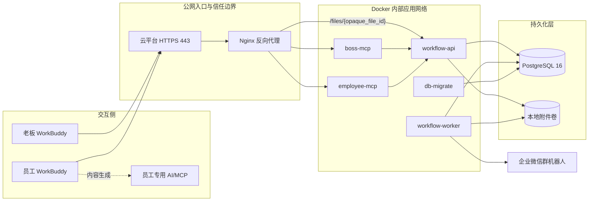

# 新媒体内容制作工作流管理后台实施方案（v1.0）

> 文档类型：开发实施方案
> 编制依据：`新媒体内容制作工作流解决方案-v1.0.md`、`AI行业选题文档上传样例.docx`
> 目标版本：试用版 v1.0
> 部署形态：Ubuntu x86_64 单机 Docker Compose
> 主要入口：WorkBuddy Agent + Streamable HTTP MCP
> 计划基线：1 名全职后端开发，业务负责人及时参与联调与验收
> 编制日期：2026-07-27
> 计划变更：2026-07-28，当前业务功能在 T2 收口，T3 暂停，直接进入 T4

## 1. 实施结论

本项目按“**模块化单体代码库 + 多容器运行 + PostgreSQL 统一事务 + 本地文件存储**”实施。第一版不开发 Web 管理页面、不内置 LLM、不接入自动发布平台，也不引入 Redis、Kubernetes 或微服务治理体系。

系统由两个 MCP 入口承接老板和员工的 WorkBuddy 操作，由工作流 API 统一执行权限、状态、分配、幂等、审计和文件规则。异步 Worker 使用 PostgreSQL 任务表与通知发件箱处理耗时任务和企业微信通知。所有任务事实、版本、审核和附件关系均以后端数据库为准。

在 1 名全职后端开发、外部联调条件按时就绪的前提下：

- 当前交付基线为 T0、T1、T2、T4；T3 不实施且不计入当前工期。
- T0—T2 加范围调整后的 T4 预计 **16—22 个工作日，即约 3—5 周**。
- T2 完成后，T4 预计 **5—7 个工作日**，其中包含架构契约整改、看板、加固和 UAT。
- T5 内部试运行建议 **2—4 周**。
- 当前最关键的上线验证是 WorkBuddy Token/Header、Word/演播稿文件字段、下载链接和企业微信 `userid` @能力。
- T0 已形成的视频 Base64 技术验证记录，但视频业务链路随 T3 一并冻结，不作为当前 T4 上线门禁。

## 2. 实施目标与范围

### 2.1 交付目标

当前试用版交付一个可在公司内部试运行的前半段内容工作流，使老板和员工只通过 WorkBuddy 完成以下闭环：

1. 老板上传任意排版 Word，WorkBuddy 大模型抽取选题并在确认后结构化提交。
2. 系统信任 MCP 抽取结果，保存原文件并去重、创建内容项目和演播稿任务，按本周任务数均衡分配。
3. 员工提交演播稿，老板审核、驳回或通过。
4. 演播稿通过后，内容项目停留在 `WAITING_FOR_FILMING`，作为当前版本的正常终态。
5. 老板查询项目进度、待审核事项、演播稿积压和人员负载。
6. 系统保留任务分配、提交版本、审核、附件、状态变化和通知的完整记录。

### 2.2 第一版范围

第一版必须包含：

- 老板、员工两套 MCP 工具白名单。
- `.env` 人员身份映射和独立 Token 鉴权。
- WorkBuddy 结构化抽取、MCP 结果直接入库、原 Word 保存、SHA-256 文件级去重和事务式导入。
- 内容项目、演播稿任务、提交、审核、附件、阻塞和审计模型。
- 周维度任务数均衡、有效开始时间、取消扣减和改派计数。
- Word 与四种演播稿文档处理。
- 本地文件存储适配层和稳定下载地址。
- 企业微信群机器人通知、去重和失败重试。
- T2 范围的看板、列表、详情、审核中心和人员负载查询。
- Docker Compose 部署、健康检查、日志轮转、数据库备份恢复和磁盘保护。

### 2.3 明确不做

以下内容不纳入 v1.0：

- 独立 Web 管理后台、登录中心和员工自助账号管理。
- 后台通用 LLM、自动审核或由模型直接改变任务状态。
- 自动发布到抖音、视频号、小红书，以及多平台并行发布。
- 视频时间码批注、在线视频编辑、字幕和封面管理。
- Redis、专用消息队列、Kubernetes、分布式文件系统。
- 对象存储、自动文件清理、法定节假日日历。
- 文件下载鉴权、自动过期链接和企业微信私聊通知。
- T3 的原片接收、剪辑任务、成片审核、上架任务和发布完成。

数据库中已经预留的剪辑、上架或视频相关通用模型不等于当前版本已交付对应
业务能力；恢复 T3 前不得向 WorkBuddy 暴露未验收的工具或把这些状态纳入当前
完成率。

### 2.4 上线前置输入

进入生产部署前需由业务/运维提供：

1. 实际子域名及云平台 443 转发到服务器的目标端口。
2. 老板和员工的中文名、角色、在岗状态、企业微信 `userid`。
3. 部署时生成的个人 MCP Token。
4. 企业微信群机器人 Webhook，由运维直接写入服务器 `.env`。
5. 任务编号前缀；未确认时使用 `WJ`。

## 3. 技术架构

### 3.1 架构原则

1. **后端是唯一事实来源**：WorkBuddy 只负责自然语言交互、文件选择、MCP 调用和结果展示。
2. **MCP 是适配层**：不直接写数据库，不保存业务状态；所有写操作进入工作流 API。
3. **权限双层校验**：MCP 按入口和工具白名单校验，工作流 API 再校验 Token 身份、角色、公司和资源归属。
4. **一次业务动作、一个事务**：业务对象、状态、审计事件、后台任务和通知发件箱在同一 PostgreSQL 事务内提交。
5. **副作用最终一致**：企业微信通知或补充媒体处理失败，不回滚已经成功的业务操作。
6. **文件访问经过适配层**：业务表只保存 `storage_provider + storage_key`，不保存宿主机绝对路径。
7. **先单机闭环，再按数据扩展**：当前每周 35—40 条目标量优先保证正确性和可运维性。

### 3.2 总体架构



### 3.3 组件职责

| 组件 | 核心职责 | 不承担的职责 |
|---|---|---|
| `reverse-proxy` | 路由、请求体限制、超时、访问日志、内部文件转发 | 业务鉴权、任务状态 |
| `boss-mcp` | 老板工具注册、参数校验、Token 初检、返回结构适配 | 直接访问数据库 |
| `employee-mcp` | 员工工具注册、本人操作入口、参数校验、返回结构适配 | 接受客户端传入的“当前员工 ID” |
| `workflow-api` | 身份、权限、状态机、分配、幂等、审计、文件元数据、查询和看板 | 企业微信发送、内容生成 |
| `workflow-worker` | URL 下载、媒体补充校验、通知、失败重试、统计刷新 | 决定审核结果或任意跳转状态 |
| `postgres` | 业务记录、锁、幂等、任务队列、通知发件箱 | 保存二进制附件 |
| 本地附件卷 | 源文档、演播稿、原片、成片和临时文件 | 保存业务关系和权限 |
| `db-migrate` | 发布前执行 Alembic 迁移 | 长期运行 |

### 3.4 代码模块边界

建议使用单仓库、单应用镜像，不同容器通过不同启动命令运行：

```text
workflow/
├── apps/
│   ├── boss_mcp/
│   ├── employee_mcp/
│   ├── workflow_api/
│   └── worker/
├── src/workflow/
│   ├── identity/          # .env 同步、Token 解析、角色和资源权限
│   ├── imports/           # Word 解析、批次、文件哈希与疑似重复
│   ├── projects/          # 内容项目和派生状态
│   ├── tasks/             # 阶段任务、状态机、优先级、任务编号
│   ├── assignments/       # 自动分配、改派、取消与周计数
│   ├── submissions/       # 版本提交与撤回扩展点
│   ├── reviews/           # 老板审核和驳回原因
│   ├── publishing/        # 单平台上架与完成说明
│   ├── attachments/       # 存储适配、文件校验和下载
│   ├── notifications/     # 发件箱、模板和企业微信适配
│   ├── jobs/              # PostgreSQL 后台任务和租约
│   ├── dashboard/         # 聚合查询和统计
│   ├── idempotency/       # 幂等键、请求指纹和首次响应
│   └── audit/             # 追加式审计事件
├── migrations/
├── tests/
│   ├── unit/
│   ├── integration/
│   ├── contract/
│   ├── fixtures/
│   └── e2e/
├── deploy/
│   ├── compose.yaml
│   ├── nginx/
│   └── scripts/
├── Dockerfile
├── pyproject.toml
└── .env.example
```

模块之间通过应用服务接口协作，不允许 MCP 工具、路由处理器或 Worker 直接拼装跨模块 SQL。状态转换、权限和幂等逻辑必须集中，避免不同入口出现不同规则。

### 3.5 技术选型

| 层次 | 选型 | 实施要求 |
|---|---|---|
| 语言 | Python 3.12 | API、MCP、Worker、文档解析使用同一运行时 |
| API | FastAPI + Uvicorn | 内部 REST API、健康检查和下载路由 |
| MCP | 官方 MCP Python SDK 稳定版 | T0 锁定已验证版本；Streamable HTTP |
| ORM/迁移 | SQLAlchemy 2.x + Alembic | 事务边界由应用服务控制 |
| 数据库 | PostgreSQL 16 | 业务库、幂等、队列和通知发件箱 |
| 文档处理 | `python-docx` | 按文档顺序解析段落和表格 |
| PDF | PyMuPDF 或仅元数据校验 | v1.0 不解析演播稿 PDF 正文 |
| 媒体信息 | `ffprobe` | 仅本地视频补充时长、分辨率、编码 |
| 反向代理 | Nginx stable | 路由、请求体、超时、`X-Accel-Redirect` |
| 部署 | Docker Engine + Docker Compose | 固定镜像版本，不使用 `latest` |
| 测试 | pytest + HTTP/MCP 集成测试 | 使用真实 PostgreSQL 和真实 Word 样例 |
| 日志 | JSON 结构化日志 | `request_id`、`actor_id`、`task_no` 可关联 |

具体依赖版本在 T0 技术验证通过后写入锁文件，不在开发期间自动跟随预发布版本升级。

## 4. 核心技术设计

### 4.1 请求与事务链路

所有写操作统一采用以下处理顺序：

1. Nginx 校验允许的路径、方法、Host、请求体和超时。
2. MCP 入口根据 Bearer Token 解析调用人，校验工具白名单和输入 Schema。
3. MCP 将原始身份凭据和规范化参数传给内部工作流 API。
4. 工作流 API 再次解析身份，校验角色、公司、资源归属和当前状态。
5. 校验 `Idempotency-Key`；相同键、相同请求返回首次结果，相同键、不同请求返回冲突。
6. 在一个数据库事务内写业务对象、状态版本、审计事件以及通知/后台任务发件箱。
7. 提交后返回统一结果；Worker 异步完成通知和可延迟处理。

统一返回结构：

```json
{
  "success": true,
  "request_id": "req_xxx",
  "data": {},
  "user_message": "面向用户的简短说明",
  "next_actions": []
}
```

失败统一返回稳定错误码，首批至少包括：

- `UNAUTHENTICATED`
- `FORBIDDEN`
- `RESOURCE_NOT_FOUND`
- `INVALID_ARGUMENT`
- `INVALID_STATE_TRANSITION`
- `IDEMPOTENCY_CONFLICT`
- `NO_ELIGIBLE_ASSIGNEE`
- `DUPLICATE_FILE`
- `FILE_TOO_LARGE`
- `UNSUPPORTED_FILE_TYPE`
- `FILE_PROCESSING_FAILED`
- `INSUFFICIENT_STORAGE`
- `CONCURRENT_MODIFICATION`
- `EXTERNAL_DEPENDENCY_FAILED`

### 4.2 Word 导入实现

Word 不再要求固定版式。默认路径是 WorkBuddy 用自身大模型抽取，后台信任 MCP
结果并直接入库；原固定模板解析器作为兼容入口保留。

1. 上传文件最大 10 MB，先写入临时目录。
2. 校验扩展名、MIME、OOXML 文件头，计算 SHA-256。
3. 结构化入口以原文件 SHA-256、Schema 版本和 MCP 任务集合生成批次指纹；固定模板兼容入口仍使用文件 SHA-256。数据库唯一约束处理并发重复导入。
4. MCP 输入 Schema 固定为 `schema_version=1.0`，每条包含 `title`、`source_text`、可空 `script`、0—1 的 `confidence` 和原文证据列表。
5. API 只校验 Schema、权限、文件扩展名/大小和幂等键，不解析 Word 内容，也不核验结构化字段是否来自原文。
6. `confidence`、`evidence` 和 `warnings` 原样保存，不作为阻断条件；任务内容以老板 MCP 提交结果为准。
7. 保存源附件、结构化内容和定位信息，在同一事务中创建、逐条分配、审计并写通知发件箱。
8. 旧 `import_topic_document` 继续按编号一级标题解析固定模板，供已有调用兼容；新 WorkBuddy 调用默认使用 `import_structured_topics`。

任务编号使用数据库内的“日期 + 前缀”计数器生成，例如 `WJ-20260727-0001`。计数器行在事务中加锁，任务编号设置唯一约束；取消任务不回收编号。

### 4.3 状态机

阶段任务的允许转换如下：

| 任务类型 | 当前状态 | 操作人/动作 | 目标状态 |
|---|---|---|---|
| 演播稿 | `IN_PROGRESS`、`REJECTED` | 员工提交新版本 | `SUBMITTED` |
| 演播稿 | `SUBMITTED` | 老板通过 | `APPROVED` |
| 演播稿 | `SUBMITTED` | 老板驳回 | `REJECTED` |
| 剪辑 | `IN_PROGRESS`、`REJECTED` | 员工提交新版本 | `SUBMITTED` |
| 剪辑 | `SUBMITTED` | 老板通过 | `APPROVED` |
| 剪辑 | `SUBMITTED` | 老板驳回 | `REJECTED` |
| 上架 | `IN_PROGRESS` | 员工提交非空完成说明 | `COMPLETED` |
| 任意未完成任务 | 非终态 | 老板取消 | `CANCELLED` |

实现约束：

- 内容项目状态由当前阶段任务和视频处理状态派生，不允许 MCP 客户端直接写项目状态。
- `PENDING_ASSIGNMENT` 只用于暂时没有可用员工或下一阶段尚未指定人员的情况。
- 通过审核时，在同一事务中完成当前任务状态、审计记录和下一阶段业务准备。
- 任务和项目均带整数 `version`；更新使用乐观锁，冲突返回最新状态。
- 每次提交创建新 `Submission` 和附件版本，不覆盖历史文件。
- 每次审核绑定具体提交版本，避免老板审核期间员工的新提交覆盖被审对象。

### 4.4 工作时间与均衡分配

统一使用 `Asia/Shanghai`：

- 工作日：周一至周五。
- 工作时间：09:00—18:00。
- 09:00 前创建：有效开始时间为当天 09:00。
- 09:00—18:00 前创建：有效开始时间等于创建时间。
- 18:00 及以后创建：顺延到下一工作日 09:00。
- 周末创建：顺延到周一 09:00。
- v1.0 不处理法定节假日。

自动分配在单个数据库事务内执行：

1. 筛选岗位为新媒体运营、在岗、资料有效且绑定个人 Token 的员工。
2. 获取 `company_id + 北京时间自然周` 的事务级锁，串行化同一公司同一周的并发分配。
3. 根据有效 `TaskAssignment` 事件统计本周分配次数。
4. 选择最少计数的员工；多人并列时随机选择并记录选择结果。
5. 写入分配事件后立即更新本次事务中的计数，再处理批次下一条任务。
6. 任务在 `effective_started_at` 前取消或改派时，写入抵消事件；到达该时刻后保留原工作量。
7. 改派时新员工增加一次分配，原员工是否抵消按同一时间规则判断。

不修改或删除历史分配记录，周计数由分配事件与抵消事件计算。优先标记只改变列表排序和通知，不改变分配计数。

### 4.5 数据模型与关键约束

| 表/对象 | 关键字段 | 关键约束或索引 |
|---|---|---|
| `actor_profiles` | 公司、中文名、角色、岗位、在岗、企业微信 userid | `(company_id, role, display_name)` 唯一；不保存明文 Token |
| `import_batches` | 文件哈希、源附件、解析状态、成功/失败数 | `(company_id, sha256)` 唯一 |
| `content_projects` | 来源批次、源序号、标题、派生状态、版本 | `(company_id, status, created_at)` 索引 |
| `stage_tasks` | 任务编号、类型、状态、负责人、优先级、有效开始时间、版本 | `task_no` 唯一；`(company_id, assignee_id, status, priority)` 索引 |
| `task_assignments` | 原/新负责人、原因、分配时间、计数/抵消事件 | `(assignee_id, assigned_at)` 索引；追加写 |
| `submissions` | 任务、提交版本、提交人、附件、备注 | `(task_id, version_no)` 唯一 |
| `reviews` | 提交、审核人、结论、原因分类、意见 | 每个有效提交最多一个最终审核结论 |
| `attachments` | opaque ID、用途、存储类型、storage key、哈希、大小、处理状态 | `opaque_file_id` 唯一；业务表不保存绝对路径 |
| `publish_records` | 任务、平台、完成说明、扩展 JSON | `task_id` 唯一 |
| `blockers` | 任务、类型、说明、状态 | `(task_id, status)` 索引 |
| `audit_events` | 人员、动作、对象、前后状态、request ID、时间 | 追加写；按对象和时间索引 |
| `idempotency_records` | 人员、工具、幂等键、请求指纹、首次响应 | `(company_id, actor_id, tool, key)` 唯一 |
| `background_jobs` | 类型、关联对象、状态、租约、重试和错误 | `(status, available_at)` 索引 |
| `notifications` | 事件 ID、模板、@成员、状态、重试 | `event_id` 唯一；`(status, next_retry_at)` 索引 |

所有核心业务表包含 `company_id`、`created_at`、`updated_at`。软删除对象增加 `cancelled_at/cancelled_by` 或等价状态字段，不执行物理删除。

人员从 `.env` 启动同步到 `actor_profiles`。v1.0 以“公司 + 角色 + 中文名”匹配已有人员，因此中文名变更不能直接改 `.env` 后重启，需通过迁移脚本更新，避免生成重复人员。

### 4.6 MCP 工具实施清单

老板入口：

- `import_topic_document`
- `list_import_batch_tasks`
- `delete_imported_task`
- `change_task_assignee`
- `list_content_projects`
- `get_content_project`
- `list_pending_reviews`
- `review_script_submission`
- `submit_filmed_video`
- `assign_editing_task`
- `review_editing_submission`
- `assign_publishing_task`
- `reassign_task`
- `set_task_priority`
- `list_employees`
- `get_workflow_dashboard`

员工入口：

- `list_my_tasks`
- `get_my_task`
- `submit_script_file`
- `submit_edited_video`
- `complete_publishing_task`
- `report_task_blocker`

工具实现要求：

- 写工具必须要求幂等键。
- 员工工具不接受用于声明当前身份的 `employee_id`。
- 列表工具统一支持分页、稳定排序和可枚举过滤条件。
- 任务列表按 `PRIORITY` 在前、有效开始时间或创建时间在前的规则稳定排序。
- 返回字段使用固定英文键，`user_message` 使用中文。
- `next_actions` 只返回当前状态真正允许的后续动作。
- 工具参数和返回 Schema 在 T0 后固化为契约测试，后续修改保持向后兼容。

### 4.7 文件接收、存储与下载

#### 文档

- 选题只接收 `.docx`，最大 10 MB。
- 演播稿接收 `.docx`、`.pdf`、`.md`、`.txt`，不设置业务上限。
- 实际技术上限由 Nginx、MCP SDK、应用框架和磁盘共同决定，并在 T0/T1 后写入运维手册。
- URL 下载只允许 HTTPS，限制重定向次数、连接/读取超时、最大体积，拒绝环回、内网、云元数据和解析后落入禁用网段的地址。

#### 视频

- 外部视频 URL 只保存，不由后台访问或校验。
- Base64 解码前预估原始大小，超过约 100 MB 立即拒绝。
- 不能把 Base64 字符串、解码后字节和文件副本同时完整保存在内存中。
- T0 必须验证 MCP SDK 是否会在进入工具函数前完整解析约 133 MB 的 Base64 JSON；若会导致不可接受的内存峰值，则启用 URL 降级路径。
- 本地视频落盘后校验文件头、大小和 SHA-256，`ffprobe` 元数据提取可异步执行。

#### 存储

宿主机目录：

```text
/srv/workflow/
├── compose.yaml
├── .env
├── data/
│   ├── postgres/
│   └── files/
│       ├── topic-source/
│       ├── script/
│       ├── filmed-video/
│       ├── edited-video/
│       └── tmp/
└── logs/
```

正式文件按 `company_id/project_id/attachment_id` 分层，不使用用户文件名拼接真实路径。临时文件和正式文件位于同一文件系统，校验完成后原子移动。

下载流程为：

1. 外部访问 `/files/{opaque_file_id}`。
2. API 根据随机 ID 查询附件、处理状态和真实 `storage_key`。
3. API 返回 Nginx 内部下载指令，由 Nginx 发送文件。
4. 外部请求不能提交宿主机路径，Nginx 禁止目录列表。
5. 文件被人工清理后返回明确的“文件已不可用”状态，同时保留附件和审计记录。

`StorageAdapter` 首期实现 `LOCAL`，接口预留 `S3_COMPATIBLE` 的 `put/open/delete/exists/get_download` 能力，保证正式版迁移时业务模块不感知存储变化。

### 4.8 Worker、任务队列与通知

后台任务使用 PostgreSQL 表，Worker 通过 `FOR UPDATE SKIP LOCKED` 领取：

- 状态：`PENDING`、`RUNNING`、`SUCCEEDED`、`FAILED`、`DEAD`。
- 每条任务记录租约截止时间，Worker 异常退出后可重新领取超时任务。
- 默认最多重试 5 次，使用递增间隔。
- 参数错误、权限错误等永久错误不重试。
- 每个任务处理器必须幂等。

通知采用事务发件箱：

1. 业务事务写入唯一事件 ID 和通知负载。
2. Worker 发送企业微信群机器人消息。
3. 成功后记录响应摘要和发送时间。
4. 失败按事件 ID 重试，不重复发送已成功事件。
5. 超过重试上限进入 `DEAD`，老板可通过 WorkBuddy 查询。

通知正文只包含任务编号、标题、动作和下一步；不包含 Token、Webhook、内部路径或完整敏感参数。

### 4.9 权限与安全

- 每人独立 Bearer Token，不允许共用。
- `.env` 权限为 `600`，不进 Git、不进入镜像。
- Token、Webhook、数据库密码不得进入普通日志或错误响应。
- 老板可访问本公司全部项目；员工只能访问当前分配给本人的任务和必要附件。
- 下载地址在试用版不鉴权，依赖至少 128 位随机 opaque ID 防枚举；此风险必须在上线确认单中再次接受。
- 文件扩展名、MIME、实际文件头和大小必须交叉校验。
- 文档 URL 下载落实 SSRF 防护；外部视频 URL 绝不由后台请求。
- 审核、改派、取消、优先、完成等关键操作写追加式审计事件。
- Nginx 只开放 `/mcp/boss`、`/mcp/employee`、`/files/` 和必要健康检查；数据库和内部 API 不映射公网端口。
- MCP 入口校验 Origin、Host、方法和 Content-Type；Token 不放 URL 查询参数。

### 4.10 部署与资源

Compose 服务：

- `reverse-proxy`
- `boss-mcp`
- `employee-mcp`
- `workflow-api`
- `workflow-worker`
- `postgres`
- `db-migrate`

建议内存上限：

| 服务 | 上限 |
|---|---:|
| `reverse-proxy` | 256 MB |
| `boss-mcp` | 1 GB |
| `employee-mcp` | 1 GB |
| `workflow-api` | 1 GB |
| `workflow-worker` | 1.5 GB |
| `postgres` | 2 GB |

长期运行容器设置 `restart: unless-stopped`。API、两个 MCP 和 PostgreSQL 配置健康检查；数据库健康后再启动依赖服务。API 和两个 MCP 首期各运行 1 个进程，避免 8 GB 内存下因多进程复制大请求。

T0 本地实测约 100 MB 视频编码为 133,521,428 个 Base64 字符后，老板 MCP
进程 RSS 约为 580 MiB，因此原 512 MB 上限不足；两个 MCP 容器调整为 1 GB，
并限制大文件并发。若真实 WorkBuddy 链路资源占用更高，则启用 URL 降级方案。

Nginx 初始建议：

- 普通业务超时 60 秒。
- 大文件路由使用独立、更长的超时。
- `client_max_body_size` 初始设为 180 MB。
- 具体上限和超时以 T0 的真实 WorkBuddy 样例为准。

### 4.11 可观测性、备份与恢复

健康检查：

- `/health/live`：进程存活。
- `/health/ready`：数据库、文件目录和关键配置可用。
- MCP 初始化和工具列表自检。

日志字段至少包括：

- `timestamp`
- `level`
- `service`
- `request_id`
- `tool_name`
- `actor_id`
- `company_id`
- `task_no`
- `duration_ms`
- `result_code`

监控与保护：

- MCP 成功率、失败率和响应时间。
- Worker 队列长度、最老任务等待时间、重试和 `DEAD` 数量。
- 通知成功率和失败数量。
- 各阶段积压、阶段耗时、一次通过率和完成量。
- 磁盘剩余低于 20% 告警，低于 10% 拒绝新的本地视频。
- Docker 日志轮转，避免日志占满磁盘。

备份：

- PostgreSQL 每日逻辑备份，至少保留 7 份。
- T1 完成首次恢复演练，T4/UAT 前再次演练。
- 试用版附件是否备份由运维决定，但必须监控容量并记录人工清理。
- 发布固定执行“备份 → 迁移 → 启动 → 健康检查 → WorkBuddy 冒烟测试”。

## 5. 开发阶段计划

### 5.1 里程碑总览

| 阶段 | 工期 | 主要产出 | 阶段出口 |
|---|---:|---|---|
| T0 关键技术验证 | 2—3 个工作日 | 真实 MCP/文件/通知样例、技术决策记录 | 六项外部能力验证通过或已有明确降级方案 |
| T1 工程与业务底座 | 4—5 个工作日 | 代码骨架、Compose、身份权限、数据库、幂等、文件和 Worker | 全新环境可部署，重启不丢数据，权限隔离通过 |
| T2 选题与演播稿闭环 | 5—7 个工作日 | Word 导入、分配、任务、演播稿提交审核、通知 | 仅用 WorkBuddy 完成“导入到演播稿通过” |
| T3 视频、剪辑与上架闭环 | 暂停，不计入当前排期 | 保留需求与设计，不开发、不联调、不验收 | 由业务负责人重新立项后再恢复 |
| T4 T2 收口、加固与验收 | 5—7 个工作日 | 架构契约整改、T2 看板、运维、异常恢复、安全/性能测试、手册 | 当前 20 项验收边界全部通过 |
| T5 内部试运行 | 2—4 周 | 真实业务数据、问题清单和二期优先级 | 形成试运行复盘和正式化决策 |

### 5.2 T0：关键技术验证

目标：在开始主体开发前排除外部能力阻塞。

实施任务：

1. 启动最小老板/员工 Streamable HTTP MCP 服务。
2. 验证 WorkBuddy 能连接两个地址并正确区分工具列表。
3. 验证 Bearer Token 或可接受的安全 Header；禁止 Token 放 URL。
4. 获取 `.docx`、`.pdf`、`.md`、`.txt` 的真实 MCP 请求字段和响应样例。
5. 使用接近 100 MB 的测试视频验证 Base64 编码、请求体、SDK 内存峰值、Nginx 超时、后台落盘和响应时间。
6. 验证后台下载链接能在 WorkBuddy 中显示并点击。
7. 验证企业微信群机器人按 `userid` @老板和员工。
8. 锁定 MCP SDK、Python 依赖和协议 Schema 版本。

交付物：

- MCP 连接与鉴权样例。
- 四类文档和视频的请求/响应样例。
- 大文件测试记录：大小、耗时、峰值内存、结果。
- 企业微信通知样例。
- 技术决策记录：Base64 保留或 URL 降级、Header 形式、超时和请求体上限。

退出标准：

- 老板 Token 只能看到老板工具，员工 Token 只能看到员工工具。
- 真实文件至少成功完成一次端到端传输。
- 视频 Base64 结果作为 T0 历史技术记录保留；T3 暂停期间不作为后续阶段门禁。

### 5.3 T1：工程与业务底座

目标：建立可部署、可迁移、可恢复的工程基础。

实施任务：

1. 建立代码目录、质量检查、测试框架和统一配置模块。
2. 创建单应用镜像、Compose、Nginx 和 `db-migrate`。
3. 实现 `.env` 人员同步、Token 解析、角色权限和工具白名单。
4. 建立首版数据模型、Alembic 迁移和种子/测试数据。
5. 实现幂等记录、追加式审计、乐观锁和统一错误码。
6. 实现 PostgreSQL 后台任务、租约、重试和通知发件箱。
7. 实现本地存储适配层、临时文件、原子移动、下载路由和磁盘检查。
8. 实现结构化日志、健康检查和 Docker 日志轮转。
9. 执行数据库备份与恢复演练。

测试重点：

- 老板/员工/无效 Token 权限矩阵。
- 同一幂等键重复调用和请求指纹冲突。
- 容器重启、重建后数据库和附件仍存在。
- Worker 中断、租约超时和任务重领。
- 磁盘空间阈值保护。

退出标准：

- 一条标准命令可以在全新 Ubuntu 环境启动全部服务。
- 所有服务通过健康检查。
- 内部端口不暴露公网。
- 老板和员工不能越权。
- 备份能够恢复到测试数据库。

### 5.4 T2：选题与演播稿闭环

目标：先交付最频繁、业务价值最明确的前半段流程。

实施任务：

1. 使用真实 Word 样例实现文档顺序解析和字段提取。
2. 实现文件 SHA-256 去重、批次唯一约束、部分成功和疑似标题重复提示。
3. 实现任务编号、内容项目、演播稿任务和项目派生状态。
4. 实现工作日有效开始时间及其完整边界测试。
5. 实现周均衡分配、并列随机、并发锁、取消扣减和改派计数。
6. 实现导入结果列表、删除、改派、优先标记和员工列表。
7. 实现员工待办、详情和四种格式演播稿提交。
8. 实现老板待审核列表、通过、驳回、版本和历史意见。
9. 接入新任务、改派、取消、提交、通过和驳回通知。
10. 完成从 WorkBuddy 发起的端到端自动化/人工联合测试。

测试重点：

- 样例稳定拆出 10 个选题，文末核验区不生成任务。
- 相同文件并发导入只创建一个批次。
- 多员工分配差值符合最小计数规则。
- 工作时间、周五晚间和周末的有效开始时间。
- 提交/审核重试不创建重复版本。
- 驳回后仍由原员工修改。
- 员工无法读取他人任务或附件。

退出标准：

- 老板从 WorkBuddy 上传样例后获得 10 条任务编号、标题和中文负责人。
- 老板可删除、改派和设置优先。
- 员工提交演播稿、老板驳回后重提、最终通过的全流程可完成。
- 所有分配、提交、审核和通知均有审计记录。

### 5.5 T3：视频、剪辑与上架闭环（暂停）

状态：根据 2026-07-28 范围变更暂停，不进入当前开发、测试、UAT 和上线范围。

以下内容只作为待恢复的产品 Backlog，不是当前实施任务：

1. 实现外部原片 URL 保存和 WorkBuddy 可点击返回。
2. 按 T0 决策实现 Base64 原片接收或 URL 降级方案。
3. 实现原片附件、处理状态和可选媒体元数据。
4. 实现老板指定剪辑员工和剪辑要求。
5. 实现员工提交外部 URL/Base64 成片、版本和备注。
6. 实现老板成片审核、文字驳回和原员工重提。
7. 实现抖音、视频号、小红书单平台上架任务。
8. 实现员工非空 `completion_note` 和项目完成。
9. 实现大文件失败恢复、磁盘不足、重复请求和状态冲突处理。
10. 补齐视频、剪辑和上架相关通知。

测试重点：

- URL 不被后台访问，原样保存和返回。
- Base64 格式错误、超过上限、解码失败、伪造文件头和磁盘不足。
- 成片驳回后的版本链和负责人保持正确。
- 未通过演播稿不能创建剪辑，未通过成片不能创建上架。
- 完成说明为空时拒绝完成任务。

未来恢复 T3 时的退出标准：

- 至少一条内容通过 WorkBuddy 从选题导入走到上架完成。
- 原片、成片、提交、审核、负责人、平台和完成说明均可追溯。
- 大文件失败不改变错误的业务状态，重试不产生重复记录。

### 5.6 T4：T2 收口、看板、运维与验收

目标：以演播稿审核通过为业务终点，修复 T0—T2 的契约与架构偏差，补齐可管理性并完成试运行前验收。

实施任务：

1. 将 MCP 改为内部工作流 API 客户端，取消 MCP 进程直接访问业务数据库。
2. 工作流 API 使用原始 Bearer Token 再次认证，并校验角色、公司、资源归属和状态。
3. 统一规格错误码、失败返回结构、`request_id`、修复建议和契约测试。
4. 实现 T2 工作概览、演播稿积压、今日/本周审核通过量和目标差额。
5. 实现项目列表、详情时间线、待审核中心和人员负载。
6. 将 `WAITING_FOR_FILMING` 明确定义为当前版本正常终态，不生成剪辑或上架任务。
7. 实现分页、过滤、稳定排序和下一步动作提示。
8. 实现失败后台任务、失败通知和阻塞事项查询。
9. 完成权限、并发、幂等、异常恢复和文档文件边界回归测试。
10. 完成日志、磁盘、数据库、容器和 T2 关键业务指标检查。
11. 编写部署、升级、回滚、备份、恢复、人员配置和故障手册。
12. 使用真实人员、真实 Word/演播稿和真实企业微信群完成 UAT。
13. 再次执行数据库恢复演练和 WorkBuddy 冒烟测试。

退出标准：

- 原解决方案第 18 章按本次范围调整后的 20 项验收边界全部有测试证据。
- MCP 容器没有业务数据库凭据；所有 T2 写操作经 workflow-api 完成二次鉴权。
- 所有已公布错误场景返回规格规定的稳定错误码。
- P0/P1 缺陷清零；P2 缺陷具有业务接受的规避方案和修复计划。
- 运维人员可按手册独立部署、备份、恢复和查看故障。
- 业务负责人签署试运行确认。

执行顺序与工作量：

| 工作包 | 工期 | 必须完成的结果 |
|---|---:|---|
| T4-A 架构与契约整改 | 2—3 个工作日 | T2 内部 API、Token 二次认证、MCP 移除数据库凭据、稳定错误码与契约测试 |
| T4-B 看板与可运维性 | 1—2 个工作日 | T2 概览/积压/负载、失败任务与通知查询、指标和操作手册 |
| T4-C 回归与 UAT | 2 个工作日 | 当前 20 项证据、恢复演练、真实 WorkBuddy/企业微信验收、缺陷收口 |

T4-A 是 T4-B、T4-C 的准入条件；不得在保留 MCP 直连数据库的情况下以
“功能可用”为由进入 UAT。T3 Backlog 不得穿插进入 T4。

### 5.7 T5：内部试运行

目标：用真实业务数据验证流程，而不是立即增加新功能。

每周复盘：

- 选题导入、演播稿积压和平均处理时间。
- 演播稿一次通过率和平均修改次数。
- 每周演播稿审核通过量与 35—40 条目标的差额。
- WorkBuddy/MCP 调用失败、重复调用和用户困惑点。
- 企业微信通知失败和噪音。
- 磁盘实际增长、临时文件残留和人工清理频率。
- 员工使用 AI 辅助内容制作时的障碍。

试运行结束输出：

- 业务效果与稳定性报告。
- 未解决缺陷和操作改进清单。
- 正式版是否优先建设对象存储、文件鉴权、账号中心、AI 质检或自动发布的排序。

### 5.8 周度排期参考

在没有外部阻塞、单人顺序开发的情况下：

| 周次 | 计划 |
|---|---|
| 第 1 周 | T0 完成；T1 启动 |
| 第 2 周 | T1 完成；T2 启动 |
| 第 3 周 | T2 完成并进行前半流程演示 |
| 第 4 周 | 跳过 T3；T4 架构契约整改、T2 看板和回归测试 |
| 第 5 周 | T4 UAT、缺陷修复、恢复演练和上线缓冲 |

该排期以阶段出口为准。WorkBuddy、企业微信、域名或真实人员资料未就绪时，应显式记录为外部依赖，不通过压缩测试时间追回进度。

## 6. 测试与质量门禁

### 6.1 测试分层

| 层次 | 覆盖内容 |
|---|---|
| 单元测试 | 状态机、工作日计算、分配计数、错误码、文件名和 MIME 校验 |
| 数据库集成测试 | 唯一约束、事务回滚、行锁/事务锁、幂等、Worker 领取 |
| 解析器测试 | 真实样例、缺失标题、缺失正文、表格穿插、异常 Heading、空文档 |
| MCP 契约测试 | 工具白名单、输入/输出 Schema、分页、错误结构、`next_actions` |
| 安全测试 | 越权、SSRF、路径穿越、伪造文件、Token/日志泄漏 |
| 并发测试 | 重复导入、重复提交、同时审核、并发分配和改派 |
| 文件边界测试 | Word/演播稿超限、伪造类型、断开、磁盘不足和 SSRF 防护 |
| 端到端测试 | 选题导入 → 演播稿提交 → 驳回重提 → 审核通过 |
| 恢复测试 | 数据库备份恢复、容器重建、Worker 租约恢复 |

### 6.2 完成定义

一项功能只有同时满足以下条件才可标记完成：

- 正常路径和主要异常路径已实现。
- 权限、状态和幂等规则已覆盖。
- 关键操作产生审计事件。
- 需要通知时已写入发件箱。
- 单元/集成/契约测试通过。
- MCP 返回可被 WorkBuddy 正确展示。
- 操作日志不包含 Token、Webhook 或敏感配置。
- 文档和运维说明同步更新。

### 6.3 验收映射

| 阶段 | 重点覆盖的原方案验收项 |
|---|---|
| T1 | 当前第 15、16、19、20 项，以及第 17、18 项的基础能力 |
| T2 | 当前第 1—14 项的业务能力 |
| T3 | 暂停；原片、剪辑、成片审核、上架与发布验收不进入当前基线 |
| T4 | 重点收口当前第 5、12、17—20 项，并对第 1—20 项做完整回归 |

## 7. 发布、回滚与运行

### 7.1 环境策略

- 开发环境：开发机 Compose，使用脱敏测试数据。
- 验收环境：与生产相同镜像和配置结构，使用真实 WorkBuddy/企业微信链路。
- 生产环境：单机 Compose。
- 8 GB 服务器不建议长期同时运行完整验收和生产栈；验收可使用独立机器或短时、隔离的 Compose 项目。

### 7.2 首次发布

1. 检查 `.env`、目录权限、磁盘空间和云平台转发。
2. 拉取固定版本镜像。
3. 创建 PostgreSQL 卷、附件目录和日志目录。
4. 启动 PostgreSQL 并等待健康。
5. 执行 `db-migrate`。
6. 启动 API、Worker、两个 MCP 和 Nginx。
7. 检查全部健康状态和 MCP 工具列表。
8. 使用老板/员工 Token 分别执行权限冒烟。
9. 导入一份测试 Word，完成一次提交/审核和通知。
10. 记录发布版本、迁移版本和验证结果。

### 7.3 日常升级与回滚

- 升级前执行数据库备份。
- 数据库迁移遵循“先扩展、再迁移、后收缩”，避免应用回滚时读取不了新结构。
- 健康检查或冒烟失败时，先停止新版本容器并恢复上一固定镜像。
- 如果迁移不可向后兼容，不自动降级数据库；按对应迁移的恢复手册执行。
- 文件存储键和下载路由保持兼容，升级不得批量移动历史文件而不做校验。

## 8. 主要风险与应对

| 风险 | 等级 | 触发信号 | 应对措施 |
|---|---|---|---|
| WorkBuddy 无法携带安全 Header | 高 | T0 连接时只能使用 URL 参数 | T0 确认替代安全 Header；不能把 Token 放查询参数 |
| 100 MB Base64 造成内存/超时问题（T3 冻结） | 暂不评级 | 恢复 T3 并重新启用视频上传 | 复用 T0 记录但必须重新压测；不进入当前 T4 门禁 |
| Word 模板发生变化 | 中 | 找不到编号一级标题或必填区块 | 规则版本化、部分成功、错误明细；新模板先增加 fixture |
| 并发导入破坏均衡 | 中 | 同一周任务集中到少数员工 | 公司+周事务锁、唯一约束、并发集成测试 |
| 本地磁盘增长过快 | 中 | 剩余空间低于 20% | 告警、低于 10% 拒绝新附件、人工清理手册 |
| 公开下载地址泄露 | 中 | 链接被转发给非相关人员 | 128 位随机 ID、禁止目录列表；正式版增加鉴权/签名链接 |
| 单机故障导致停机 | 中 | 主机或磁盘故障 | 每日数据库备份、恢复演练；正式版评估附件备份和对象存储 |
| 企业微信群通知暴露业务内容 | 中 | 群成员范围扩大 | 消息最小化；不发送正文、Token 和内部链接；业务接受群可见边界 |
| 外部文档 URL 引发 SSRF | 高 | URL 指向内网/元数据地址 | HTTPS 白名单规则、DNS/IP 双重校验、重定向复验、大小和超时限制 |
| 人员中文名变更产生重复档案 | 中 | `.env` 直接改名后重启 | 通过迁移脚本改名；正式版增加稳定人员编码 |
| 无法定节假日导致耗时偏差 | 低 | 节假日任务统计不符合实际 | v1.0 明示边界；试运行后决定是否接入工作日历 |

## 9. 项目管理与决策机制

### 9.1 角色分工

| 角色 | 责任 |
|---|---|
| 业务负责人/老板 | 需求取舍、真实样例、验收、外部配置协调 |
| 后端开发 | 架构、编码、测试、部署配置、技术文档和缺陷修复 |
| 运维协作人 | 域名转发、服务器目录、`.env`、备份和磁盘处理 |
| 员工代表 | 员工 MCP 可用性、文件提交和任务通知体验验证 |

若条件允许，T4 增加独立测试人员执行权限、并发、文件边界和恢复测试；如果仍由开发自测，业务 UAT 不能省略。

### 9.2 变更控制

以下变化视为范围变更，需要重新评估工期：

- 新增 Web 页面或账号中心。
- 改为多平台同时上架。
- 后台接入 LLM 或自动审核。
- 增加对象存储、文件鉴权或自动清理。
- Word 输入模板发生结构性变化且需兼容多版本。
- WorkBuddy 需要新增尚不存在的文件上传能力。
- 恢复 T3，或新增原片、剪辑、成片审核、上架和发布完成能力。

小范围字段文案和查询筛选可进入当前阶段；改变状态机、权限、存储链路或外部集成的需求进入变更清单，由业务负责人确认优先级。

## 10. 最终交付物

T4 完成时应交付：

1. 可构建的单仓库源代码和依赖锁文件。
2. 老板/员工 MCP 服务、工作流 API 和 Worker。
3. Alembic 数据库迁移。
4. Dockerfile、`compose.yaml`、Nginx 配置和 `.env.example`。
5. Word 解析、演播稿状态机、权限、幂等、分配、文件和通知测试。
6. 当前 20 项验收记录和“选题导入到演播稿通过”端到端测试证据。
7. 部署、升级、回滚、备份、恢复和故障处理手册。
8. MCP 工具参数、返回值、错误码和 WorkBuddy 示例。
9. 数据模型、状态转换和权限矩阵。
10. T5 试运行指标口径和复盘模板。

本实施方案用于指导 v1.0 工程落地；如原解决方案与实施细节出现冲突，以已确认业务边界为准，并通过变更记录更新两份文档。
