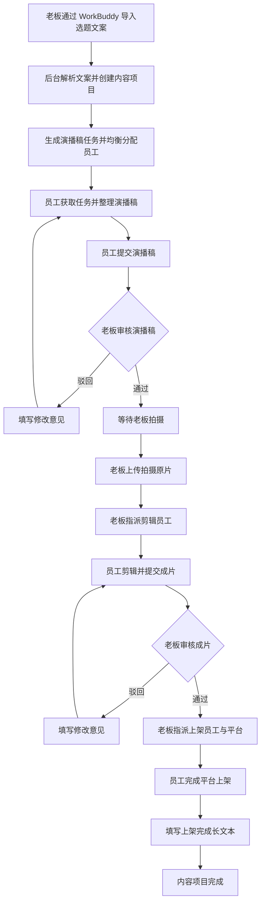
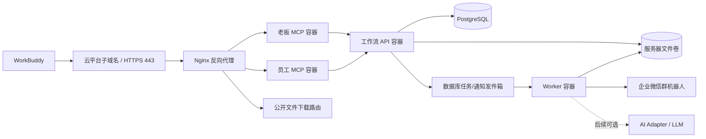

# 新媒体内容制作工作流管理后台解决方案（v1.0 试用版方案定稿）

> 文档状态：T2 范围收口，T3 暂停，T4 计划已确认
> 更新时间：2026-07-28
> 适用入口：WorkBuddy
> 主要交互方式：WorkBuddy Agent 通过 MCP Server 调用工作流后台能力
>
> v1.0 更新：确认 500 GB 为可用磁盘，Docker Engine 与 Docker Compose 已安装；使用子域名 443 访问，证书由云平台自动续签；WorkBuddy 作为标准 Agent 按 MCP 协议访问。试用版继续使用本地磁盘并人工清理，正式化时迁移到对象存储。
>
> 范围变更（2026-07-28）：当前业务功能在 T2“选题与演播稿闭环”收口，
> T3“视频、剪辑与上架闭环”暂停，直接进入 T4。本文保留 T3 的目标设计，
> 作为未来 Backlog，不属于当前开发、UAT 或上线验收范围。当前版本在演播稿
> 审核通过并进入 `WAITING_FOR_FILMING` 后结束。

## 1. 文档目的

本文根据当前提供的业务背景，整理一版可继续讨论的系统方案。重点是确认业务流程、角色权限、任务状态、MCP 能力边界、数据结构和实施路径。

这不是最终开发规格。业务主流程已经基本确认，本版开始固定第一阶段技术边界和实施路线；文末保留部署环境与联调条件等需要继续确认的问题。

## 2. 建设背景与目标

公司需要持续生产并发布短视频内容。目前流程包括选题文案导入、演播稿整理、老板审核、视频拍摄、剪辑、成片审核和平台上架。老板和员工主要通过 WorkBuddy 工作，工作流管理后台负责流程编排、文件管理、权限控制、状态记录和进度监控。

项目目标：

1. 老板能够清楚看到每条内容当前处于哪个阶段、由谁负责、等待了多久、是否被驳回以及整体完成情况。
2. 员工可以通过 WorkBuddy 获取自己的任务，借助 AI/MCP 完成内容整理，并把结果回传到对应任务。
3. 所有交付物、审核意见和状态变化都关联到具体内容项目，避免通过聊天或文件名人工追踪。
4. 任务分配在尽量平均的基础上，兼顾员工是否在岗、是否具备对应能力和当前工作量。
5. 第一版通过 WorkBuddy 完成全部业务操作和看板查询，不单独开发 Web 管理页面。
6. 系统先支持公司内部可控闭环，后续再考虑 Web 管理端、自动发布、数据回流和市场化能力。

## 3. 当前需求理解

### 3.1 参与角色

#### 老板

- 导入 ChatGPT 已生成的行业选题文案。
- 导入完成后，在 WorkBuddy 中浏览任务编号、标题和分配员工中文名。
- 删除本次导入产生的单个任务。
- 更换单个任务的负责员工。
- 查看内容项目及所有阶段任务。
- 查看和审核员工回传的演播稿。
- 驳回不合格的演播稿并填写修改意见。
- 上传自己拍摄的原始视频。
- 指派员工剪辑。
- 审核剪辑成片，可以通过或驳回。
- 指派员工上架短视频。
- 将个别任务标记为“优先处理”。
- 通过 WorkBuddy 查看工作进度、阶段积压、人员负载和最终结果。

#### 员工

- 通过 WorkBuddy 获取分配给自己的任务。
- 查看任务说明、优先标记、源文案、附件和历史意见。
- 自己整理演播稿，或调用员工专用 AI/MCP 能力辅助生成。
- 回传演播稿或其他阶段交付物。
- 根据驳回意见修改并重新提交。
- 完成视频剪辑并回传成片。
- 按要求将成片上架到指定短视频平台。
- 回填发布结果并确认任务完成。

#### 系统管理员

第一版由老板兼任。系统不建设独立登录中心，在服务器 `.env` 中配置人员中文名、角色和个人 MCP Token。为了在企业微信群中 @负责人，还需要为老板和员工配置企业微信 `userid`。管理员还负责平台字典、流程配置和异常任务处理。

### 3.2 系统边界

本期建议把系统划分为以下部分：

- **WorkBuddy Agent**：老板和员工的主要操作入口，负责自然语言交互、文件选择和 MCP 调用。
- **老板 MCP Server**：只暴露老板有权使用的查询、导入、审核、分配、上传和管理能力。
- **员工 MCP Server**：只暴露当前员工的任务查询、任务提交、文件上传和执行确认能力。
- **员工专用 AI/MCP 服务**：由 WorkBuddy 按需调用，负责生成、改写和润色内容；不直接访问工作流数据库，也不直接修改任务状态。
- **工作流后台服务**：业务规则、状态机、任务分配、权限校验、审核记录和统计分析的唯一事实来源。
- **本地文件服务**：第一版使用后台服务器本地磁盘保存选题文案、演播稿、拍摄原片和剪辑成片，并通过稳定下载地址提供文件。
- **异步任务服务**：处理大文件下载、文件校验、媒体元数据提取、通知和统计等耗时操作。
- **企业微信群机器人通知适配器**：向统一工作群发送新任务、驳回、改派、取消和优先任务等通知，并 @相关员工。

第一版不开发管理后台 Web，老板的看板、列表、详情、审核和人员负载查询均由 WorkBuddy 调用老板 MCP Server 返回。MCP Server 不单独保存业务状态，只负责身份识别、参数校验、权限控制、调用后台服务，并将适合 Agent 使用的结构化结果返回给 WorkBuddy。第一版工作流后台不调用 LLM，所有内容生成在 WorkBuddy 或员工专用 AI/MCP 服务侧完成。

## 4. 推荐的业务模型

不建议用“一条任务不断换负责人和状态”来承载全部流程。脚本、剪辑、上架往往由不同员工负责，也可能分别被驳回。建议采用两层模型：

- **内容项目（Content Project）**：代表一条最终要发布的短视频内容，从选题导入开始，直到发布完成。
- **阶段任务（Stage Task）**：代表内容项目中一次可分配、可提交、可审核的具体工作。

每个内容项目通常包含：

1. 演播稿任务（Script Task）
2. 剪辑任务（Editing Task）
3. 上架任务（Publishing Task）

这样可以独立记录每个阶段的负责人、优先标记、提交次数、审核意见、耗时和交付物，也能在人员变更时保留完整历史。

## 5. 端到端工作流程



### 5.1 导入选题文案

老板在 WorkBuddy 中上传 Word 格式的行业选题文案。文档由 ChatGPT 或人工生成，
不要求固定标题样式、编号或字段。WorkBuddy 使用自身大模型理解文档，先向老板展示
抽取预览，确认后调用 `import_structured_topics`；工作流后台不配置 LLM 密钥。

1. 接收原始 `.docx` 并计算 SHA-256 文件哈希。
2. 结构化导入按 `company_id + file_hash` 去重。同一文件即使被 MCP 重新整理为不同任务集合，也返回原批次和 `deduplicated: true`，不再导入或生成任务。
3. WorkBuddy 先通过独立 `upload_file` 获得 `file_key`，再提交 `title`、`source_text`、可空 `script`、`confidence`、`evidence`、`warnings` 和 `file_key`。
4. 后台信任老板 MCP 的结构化结果，不把字段与 Word 原文逐项比对，也不根据置信度、重复内容或证据文本阻断导入。
5. 保存原始文件并创建导入批次；数据库对公司和文件哈希建立唯一约束，防止并发重复导入。
6. 标题相同但文件哈希不同只在结果中提示疑似重复，不阻止创建。
7. 为每个有效选题直接创建内容项目和演播稿任务；缺少现成口播稿时保留 `script=null`。
8. 在在岗的新媒体运营员工池中逐条指派；同一批次前面已分配的任务立即计入本周负载，保证本批任务和本周累计任务数都尽量平均。
9. 创建完成后直接向 WorkBuddy 返回本批任务列表和 `deduplicated: false`，不再增加“预检后确认导入”步骤。

导入返回给老板浏览的每条任务至少包含：

- `task_no`：系统生成且全局唯一的任务编号，例如 `WJ-20260724-0001`。
- `title`：从当前 Word 选题区块提取的任务标题。
- `assigned_employee_name`：被分配员工的中文名。

结构化结果中的顺序生成 `source_sequence`，`source_index` 额外保留模型给出的页码、
段落或表格定位信息，但不替代系统任务编号。旧固定模板仍可通过
`import_topic_document` 兼容导入。员工资料中的中文名应设为必填字段；没有中文名
的员工不能进入自动分配候选池。

### 5.1.1 导入后的老板调整

老板浏览导入结果后，可以通过 WorkBuddy：

- 删除单个任务。
- 为单个任务选择其他员工。
- 重新获取本导入批次的最新任务列表。

为保证审计和数据完整性，“删除”在后台实现为软删除/取消，不物理删除数据库记录。被删除任务不再出现在员工待办和老板的默认任务列表中，但导入来源、原分配人、删除人和删除时间仍可追溯。

更换员工后，系统立即更新任务负责人，并记录原员工、新员工、操作人、操作时间和原因。手动更换不会触发其他任务的自动重新平衡；后续新任务分配时使用更新后的实际负载。

删除或更换员工后，MCP 工具返回受影响任务以及本批次更新后的任务列表，使 WorkBuddy 能直接向老板展示最新结果。

任务创建和改派后立即生效，员工不需要领取或接受。任务默认无截止时间、无数字优先级；老板可以将个别任务设为“优先处理”，员工获取任务时优先任务排在普通任务之前。

### 5.2 演播稿制作与审核

员工通过员工 MCP Server 获取分配给自己的演播稿任务。员工可以：

- 查看源文案、目标受众、建议视频时长和表达风格。
- 自行整理演播稿。
- 调用员工专用 AI/MCP 服务生成或改写草稿。
- 上传演播稿文件，不要求后台提供在线编辑器。

提交后，任务进入“待审核”。演播稿只由老板一人审核；老板可以通过，或填写修改意见后驳回。驳回后自动回到原员工，不触发重新分配。

### 5.3 拍摄原片上传与剪辑

演播稿通过后，内容项目进入“待拍摄”。老板完成拍摄后，可以提交外部视频 URL，也可以通过 WorkBuddy 先预上传最大约 100 MB 的本地视频并传入 `file_key`。外部 URL 仅作为可点击链接保存；本地视频解码后保存到文件服务。提交成功后，老板从同一个新媒体运营员工池中选择剪辑员工并填写剪辑要求。

剪辑员工提交成片后，老板审核：

- 通过：创建上架任务。
- 驳回：填写问题类型和修改意见，剪辑任务回到原员工。

成片只由老板一人审核。第一版驳回意见使用普通文字，不开发视频时间码批注。

### 5.4 上架与完成

成片审核通过后，老板从同一个新媒体运营员工池中指定上架员工，并从抖音、视频号、小红书中选择一个目标平台。第一版一条成片只创建一个上架任务，不同时发布多个平台。

员工人工上架后填写一个非空长文本 `completion_note` 并确认完成，内容由员工自行组织，可以包含发布链接、时间、账号、异常说明等信息。后台不解析或强制拆分这些字段。提交后，上架任务和内容项目标记为完成。

第一版不单独保存发布账号、作品 ID、发布链接、实际/预约时间、标题、简介、话题和封面，但数据模型预留扩展能力。自动发布和多平台分发作为后续独立阶段。

## 6. 状态设计

### 6.1 内容项目状态

| 状态 | 含义 |
|---|---|
| `TOPIC_IMPORTED` | 选题已导入 |
| `SCRIPT_IN_PROGRESS` | 演播稿制作中 |
| `SCRIPT_REVIEW` | 演播稿待老板审核 |
| `WAITING_FOR_FILMING` | 演播稿通过，等待拍摄 |
| `VIDEO_PROCESSING` | 原片上传后正在处理 |
| `EDITING_IN_PROGRESS` | 视频剪辑中 |
| `EDITING_REVIEW` | 剪辑成片待审核 |
| `PUBLISHING_IN_PROGRESS` | 正在上架 |
| `COMPLETED` | 已完成上架 |
| `ON_HOLD` | 暂停 |
| `CANCELLED` | 已取消 |

内容项目状态由阶段任务和文件处理结果推导，尽量不允许客户端随意直接修改。

### 6.2 阶段任务通用状态

| 状态 | 含义 |
|---|---|
| `PENDING_ASSIGNMENT` | 待分配 |
| `IN_PROGRESS` | 任务已生成并分配，立即视为处理中 |
| `SUBMITTED` | 员工已提交，等待审核或验收 |
| `REJECTED` | 被驳回，等待修改 |
| `APPROVED` | 已审核通过 |
| `COMPLETED` | 无需审核的任务已完成 |
| `CANCELLED` | 已取消 |

任务生成并成功分配后直接进入 `IN_PROGRESS`，不经过员工领取或 `ASSIGNED`。例如员工不能自行将任务设为 `APPROVED`，老板也不能在没有合格成片时创建上架任务。

任务同时记录 `created_at` 和 `effective_started_at`：

- 周一至周五 09:00 之前生成：`effective_started_at` 记为当天 09:00。
- 周一至周五工作时间内生成：`effective_started_at` 等于 `created_at`。
- 周一至周四 18:00 及以后生成：顺延到下一个工作日 09:00。
- 周五 18:00 及以后生成：顺延到周一 09:00。
- 周六或周日生成：顺延到周一 09:00。
- 第一版不接入法定节假日日历，除周末外的日期都按普通工作日处理。

业务状态在生成后立即为 `IN_PROGRESS`；`effective_started_at` 只用于耗时统计和取消后的周工作量判定。

### 6.3 驳回与重提

每次提交和审核都生成新版本，不覆盖旧文件和旧文本。系统至少记录：

- 第几次提交
- 提交人、提交时间
- 交付物版本
- 审核人、审核时间
- 审核结论
- 驳回原因分类
- 文字意见

这样既便于追溯，也可以统计一次通过率、平均修改次数和常见问题。

## 7. 任务分配策略

第一版按任务数量做周维度均衡，不计算预计工时、难度和岗位权重。演播稿、剪辑、上架均从同一个新媒体运营员工池分配，每生成一个阶段任务都计为 1 个任务。

### 7.1 候选人过滤

先筛选满足以下条件的员工：

- 岗位为新媒体运营。
- 人员档案有效且当前在岗。
- 已绑定可识别个人身份的 MCP Token。

老板不参加员工自动分配，但可以创建、审核、取消和改派任务。

### 7.2 周均衡算法

按北京时间自然周（周一 00:00 至周日 23:59:59）统计每位候选员工本周被分配的任务数。自动分配一条任务时：

1. 找出本周任务数最少的员工。
2. 如果只有一人，直接分配给该员工。
3. 如果多人并列最少，在并列人员中随机选择。
4. 分配成功后立即把该任务计入本周数量，再处理下一条。

统计口径使用“本周有效分配次数”，包括系统分配和老板手动指定：

- 在 `effective_started_at` 之前删除/取消：从该员工本周分配数中扣除。这可能发生在工作日 09:00 前、工作日 18:00 及以后或周末生成的任务于有效开始时间前被取消时。
- 在 `effective_started_at` 时刻或之后删除/取消：保留一次工作量记录，不扣除。
- 老板改派任务：新员工增加一次分配记录；原员工按上述时间规则决定是否扣除。

历史分配事件始终保留，周计数通过有效性规则计算，不物理删除历史记录。

### 7.3 人工调整与优先处理

- 系统分配后任务立即生效，不需要员工领取。
- 老板可以删除/取消任务，也可以指定其他在岗新媒体运营员工。
- 每次自动分配、手动指定、改派和取消都保存原因与操作记录。
- 任务只有 `NORMAL`（普通）和 `PRIORITY`（优先处理）两个等级。
- 优先标记只影响 WorkBuddy 返回顺序和企业微信提醒，不影响周均衡计数。

第一版不设置截止时间、加急时限、逾期判断和并行任务上限。后续有真实数据后，再判断是否需要增加工作量权重或产能限制。

## 8. MCP Server 设计

### 8.1 两个专有 MCP Server

建议逻辑上分为两个服务入口：

- `boss-workflow-mcp`
- `employee-workflow-mcp`

两个入口可以是同一套代码部署，也可以独立部署，但必须使用不同的工具白名单和权限策略。权限控制不能只依赖“工具名称不同”，后台业务接口仍需根据 Token 解析出的身份和角色做二次校验。

### 8.2 身份识别

每次调用携带访问 Token。实验版启动时从服务器 `.env` 读取“姓名—角色—Token—企业微信 @标识”的配置，并构建内存身份映射。建议的配置项为：

```dotenv
MCP_BOSS_NAME=老板姓名
MCP_BOSS_TOKEN=请生成高强度随机值
MCP_BOSS_WECOM_USERID=老板企业微信userid
MCP_EMPLOYEES_JSON='[{"name":"员工姓名","token":"高强度随机值","wecom_userid":"企业微信userid","active":true}]'
WECOM_GROUP_WEBHOOK_URL=https://qyapi.weixin.qq.com/cgi-bin/webhook/send?key=...
APP_TIMEZONE=Asia/Shanghai
WORKDAY_START=09:00
WORKDAY_END=18:00
```

不接受客户端直接传入 `employee_id` 来决定“我是谁”。员工查询任务、提交任务时，人员身份必须来自 Token。老板替员工操作或指定负责人时，才在参数中显式传目标员工 ID。

每人必须使用独立 Token，禁止共用。`.env` 不提交到 Git，部署机文件权限限制为仅服务账号可读，应用日志不得打印环境变量或完整 Token。实验版修改人员或 Token 后通过重启服务生效；后续正式化时再迁移到数据库和密钥管理服务。创建、提交、审核、改派等写操作必须携带幂等键，避免 Agent 重试导致重复操作。

### 8.3 老板 MCP 工具建议

| 工具名（建议） | 作用 |
|---|---|
| `upload_file` | 由 MCP Host 预上传本地文件并返回临时 `file_key` |
| `import_topic_document` | 使用预上传 `file_key` 或 URL 解析 Word，直接创建、分配任务并返回任务编号、标题和员工中文名列表 |
| `list_import_batch_tasks` | 获取某次导入产生的最新任务列表 |
| `delete_imported_task` | 删除/取消本次导入中的单个任务，并返回更新后的任务列表 |
| `change_task_assignee` | 更换单个任务的员工，并返回更新后的任务列表 |
| `list_content_projects` | 按状态、员工、时间、优先标记等条件查询内容项目 |
| `get_content_project` | 获取项目详情、阶段任务、附件、提交和审核历史 |
| `list_pending_reviews` | 获取待审核的演播稿或剪辑成片 |
| `review_script_submission` | 通过或驳回演播稿提交 |
| `submit_filmed_video` | 保存外部视频 URL，或使用预上传 `file_key` 提交最大约 100 MB 的拍摄原片 |
| `assign_editing_task` | 指派剪辑员工和剪辑要求 |
| `review_editing_submission` | 通过或驳回剪辑成片 |
| `assign_publishing_task` | 指派上架员工和抖音/视频号/小红书中的一个目标平台 |
| `reassign_task` | 在后续流程中手动改派其他未完成任务 |
| `set_task_priority` | 设置或取消任务的“优先处理”标记 |
| `list_employees` | 获取新媒体运营员工及本周任务数量 |
| `get_workflow_dashboard` | 获取阶段数量、待审核数量、本周完成量和人员负载等看板数据 |

相关工具的关键参数建议：

- `upload_file`：只有由 MCP Host 填充的 `file_base64`，返回 `file_key`。
- `import_topic_document`：预上传 `file_key` 或可访问的 Word URL、幂等键；文件最大 10 MB。
- `submit_script_file`：`.docx`、`.pdf`、`.md`、`.txt` 的预上传 `file_key` 或 URL、原始文件名、幂等键；不设业务大小上限。
- `submit_filmed_video`：`external_video_url` 与预上传 `file_key` 二选一、原始文件名、幂等键。
- `submit_edited_video`：`external_video_url` 与预上传 `file_key` 二选一、原始文件名、备注、幂等键。
- `list_import_batch_tasks`：`import_batch_id`。
- `delete_imported_task`：`task_no`、可选删除原因、幂等键。
- `change_task_assignee`：`task_no`、`new_employee_id`、可选改派原因、幂等键。

删除或改派前，后台必须校验任务属于当前公司且调用者为老板角色。删除表现为取消任务并通知原员工；改派则清除原员工待办并通知原员工和新员工，周计数按 `effective_started_at` 规则调整。已经审核通过或已进入后续阶段的任务，不使用导入调整工具处理，而应进入内容项目的取消或流程回退操作，避免破坏后续数据关系。

### 8.4 员工 MCP 工具建议

| 工具名（建议） | 作用 |
|---|---|
| `upload_file` | 由 MCP Host 预上传本地文件并返回临时 `file_key` |
| `list_my_tasks` | 获取当前员工的任务，可按类型和状态筛选 |
| `get_my_task` | 获取本人任务详情、附件、要求和审核历史 |
| `submit_script_file` | 通过预上传 `file_key` 或可访问 URL 提交 `.docx`、`.pdf`、`.md` 或 `.txt` 演播稿，不设业务大小上限 |
| `submit_edited_video` | 保存外部视频 URL，或使用预上传 `file_key` 提交最大约 100 MB 的剪辑成片和备注 |
| `complete_publishing_task` | 提交一个非空长文本 `completion_note` 并确认上架完成 |
| `report_task_blocker` | 上报素材缺失、账号异常等阻塞问题 |

“员工专用 AI/MCP 服务”如果是独立的内容生成服务，建议只负责生成或润色内容，不直接修改工作流状态。最终仍由员工确认并调用 `submit_script_file` 回传，避免 AI 草稿未经确认直接进入老板审核队列。

### 8.5 MCP 返回结构

所有工具建议统一返回。以本次 Word 样例成功创建 10 条任务为例：

```json
{
  "success": true,
  "request_id": "req_xxx",
  "data": {
    "import_batch_id": "imp_xxx",
    "deduplicated": false,
    "created_count": 10,
    "tasks": [
      {
        "task_no": "WJ-20260724-0001",
        "title": "芯片公司先给客户50亿美元：这笔买卖最反常的地方，不是钱多",
        "assigned_employee_name": "张三"
      },
      {
        "task_no": "WJ-20260724-0002",
        "title": "人工智能开始替公司办事：真正值钱的不是聪明，而是随时能踩刹车",
        "assigned_employee_name": "李四"
      }
    ]
  },
  "user_message": "已从 Word 文档创建并分配 10 个演播稿任务。",
  "next_actions": [
    "浏览全部任务",
    "删除单个任务",
    "更换任务员工"
  ]
}
```

示例中的 `tasks` 实际返回完整 10 条任务，此处只展示前两条。任务编号不能使用数组下标临时生成；即使老板删除任务，其他任务编号也不重新编号。

相同文件哈希再次上传时返回原 `import_batch_id`、`deduplicated: true`、`created_count: 0` 和该批次当前任务列表，`user_message` 明确说明“检测到相同文件，未重复创建任务”。

失败时返回稳定错误码、适合用户理解的消息和可选修复建议：

```json
{
  "success": false,
  "request_id": "req_xxx",
  "error": {
    "code": "INVALID_STATE_TRANSITION",
    "message": "该演播稿尚未审核通过，不能创建剪辑任务。"
  }
}
```

对于 Agent 调用，返回内容需要简洁、结构稳定、字段可枚举，并明确下一步允许的操作，避免 Agent 根据自然语言猜测状态。

### 8.6 企业微信通知

第一版使用一个企业微信群机器人的 Webhook。群机器人不能向员工发送只有本人可见的私聊消息，但文本消息可以通过 `mentioned_list` 中的企业微信 `userid` 在工作群中 @指定成员。群内其他成员仍然能够看到通知内容。

所有参与人员都在同一个工作群；老板和员工的 `userid` 与姓名、Token 一起配置在 `.env`。具体能力参考[企业微信官方“群机器人配置说明”](https://developer.work.weixin.qq.com/document/path/91770)。

第一版至少发送以下群通知：

| 事件 | 群内 @成员 |
|---|---|
| 新任务分配 | 新负责人；同一导入批次分给同一人的任务合并为一条消息 |
| 任务改派 | 原负责人、新负责人 |
| 任务取消 | 当前负责人 |
| 任务设为优先处理 | 当前负责人 |
| 员工提交演播稿或成片 | 老板 |
| 老板驳回 | 原提交员工 |
| 老板审核通过并生成下一阶段任务 | 下一阶段负责人 |
| Base64 视频接收、解码或保存失败 | 视频提交人 |

业务事务成功后先写入通知发件箱，再由异步 Worker 发送群机器人消息。通知失败不回滚已经成功的业务操作；系统按事件 ID 去重并重试，超过重试次数后记录失败，供老板通过 WorkBuddy 查询。消息只包含任务编号、标题、动作和下一步，不在通知正文直接暴露 MCP Token。

## 9. 文件上传、下载与处理

第一版不使用对象存储，文件保存在后台服务器本地磁盘。数据库只保存附件 ID、`storage_provider`、与物理目录解耦的 `storage_key` 和文件元数据，不保存操作系统绝对路径。MCP 返回后台文件服务生成的稳定下载地址，例如 `https://workflow.example.com/files/{opaque_file_id}`。

为了尽快运行实验版，下载地址不要求登录或携带 Authorization Header，并且不自动过期。文件 ID 使用足够长的随机值、关闭目录列表，避免按顺序猜测其他文件。该方案不适合存放公司机密或个人敏感信息，正式化时应增加鉴权或可撤销访问令牌。

### 9.1 Word 与演播稿文件

文件支持两种 MCP 入参路径：

- 本地文件：模型明确调用独立 `upload_file` 工具；MCP Host 根据输入 Schema 的
  `contentEncoding: base64` / `format: byte` 读取文件并填充 `file_base64`，
  工具返回与调用人绑定的临时 `file_key`。后续业务工具只接收 `file_key`。
- 可访问 URL：后台从 URL 下载文件。

- 选题导入文件固定为 `.docx`，沿用最大 10 MB 的限制。
- 员工演播稿允许 `.docx`、`.pdf`、`.md`、`.txt`，不设置业务大小上限。

“不设置业务大小上限”不等于传输链路无限。反向代理、MCP 客户端和应用框架仍会有技术请求上限；开发时必须采用临时文件或流式写入，并把实际部署上限记录在运维配置中，不能一次把任意大小文件完整加载到内存。

后台收到文件后校验扩展名、MIME 类型、实际文件头和哈希，先写临时文件，校验成功后再原子移动到正式目录。任务提交只保存后台自己的附件 ID 和下载地址，不继续依赖外部 URL。

Word 或演播稿 URL 需要由后台下载，因此仍需限制为 `https` 并禁止环回地址、内网地址和云元数据地址。

### 9.2 视频文件

拍摄原片和剪辑成片支持二选一的输入方式：

- `external_video_url`：由 WorkBuddy 调用其他 MCP 获取。后台只保存 URL，不下载、不识别是 MP4、分享页还是 M3U8，也不判断有效期。WorkBuddy 获取任务详情时把它显示为类似 HTML `<a>` 的可点击链接，由老板或员工自行打开、下载和观看。
- `file_key`：先调用独立 `upload_file`，由 MCP Host 填充 Base64，返回的 key
  再交给视频业务工具；解码前原始视频最大约 100 MB。

本地文件方式的处理流程：

1. 模型明确选择 `upload_file`，MCP Host 读取并填充文件参数。
2. 上传工具单独校验 Base64 格式和预估解码大小，落盘并返回 `file_key`。
3. 100 MB 原文件编码后约为 133 MB；反向代理和应用请求上限建议至少配置为 150 MB。
4. 业务工具按当前人员、公司、有效期解析 `file_key`，再校验文件类型、哈希和媒体信息。
5. 校验成功后移动到正式目录并生成后台稳定下载地址；失败时保持原任务状态，并通过企业微信群机器人 @提交人。

WorkBuddy 的实际 Host 文件参数填充能力在第一开发阶段通过一份真实调用样例验证；
模型不得生成或转述 Base64 内容。

### 9.3 附件类型

- 选题源文件
- 演播稿文件
- 拍摄原片
- 剪辑成片

封面图、字幕文件、发布截图和其他补充素材作为后续扩展，不纳入第一版必做范围。

### 9.4 必要的文件元数据

- 原始文件名
- 存储类型：`EXTERNAL_URL`、`LOCAL_FILE`，并预留 `OBJECT_STORAGE`
- 外部 URL（仅外部链接类型）
- MIME 类型
- 文件大小
- 哈希值
- 存储位置
- 上传人和上传时间
- 所属内容项目和阶段任务
- 文件用途
- 版本号
- 处理状态
- 视频时长、分辨率、编码（仅本地视频，可选）

外部 URL 类型不强制要求文件名、MIME、大小、哈希、视频时长等本地文件元数据。

### 9.5 实验版存储边界

- 选题、项目、任务和附件使用 ID 分层目录，不能用用户文件名直接拼接路径。
- 应用服务无权覆盖历史版本；相同文件使用新的附件版本或基于哈希去重。
- 文件由运维人员人工清理；第一版不开发自动清理、保留期限和容量规划功能。
- 系统只做最低限度的剩余空间检查，磁盘空间不足时拒绝接收新视频并返回明确错误。
- 对外下载由固定文件路由处理，不开放磁盘目录列表。

### 9.6 正式版对象存储迁移路线

试用版使用 500 GB 本地磁盘，但数据模型和代码不能把“本地文件路径”写死。附件统一通过存储适配层访问，至少保存：

- `storage_provider`：`LOCAL` 或后续的 `S3_COMPATIBLE`。
- `storage_key`：与物理路径无关的对象键。
- `bucket_name`：本地存储时为空。
- `size_bytes`、`sha256`、`mime_type`。
- `migration_status`：`NOT_REQUIRED`、`PENDING`、`COPIED`、`VERIFIED`、`FAILED`。

正式化时按以下路线迁移：

1. 接入支持 S3 协议的对象存储，使用私有 Bucket，不直接开放目录。
2. 新上传文件先切换为写入对象存储；历史本地文件继续可读。
3. 后台迁移任务逐个复制历史文件，并核对大小和 SHA-256。
4. 校验成功后更新附件的 `storage_provider` 和 `storage_key`。
5. 下载接口保持 `/files/{opaque_file_id}` 不变，由后台返回短期签名地址或代理下载，WorkBuddy 不感知存储变化。
6. 观察一段时间后再人工删除已验证的本地副本。

迁移期间采用“新文件写对象存储、旧文件本地/对象存储双读”，不要求停机，也不改变任务、提交和审核记录。对象存储厂商、区域、Bucket 名称和保留策略在正式化阶段再确认。

## 10. WorkBuddy 管理与看板交互建议

第一版不做 Web 页面。老板在 WorkBuddy 中发送自然语言请求，由老板 MCP Server 返回结构化数据和适合阅读的简要汇总。

### 10.1 工作概览

- 各阶段内容数量
- 今日新增、今日完成
- 待老板审核数量
- 本周新增、完成和目标差额
- 员工本周任务数量
- 优先处理任务
- 最近驳回和阻塞事项
- 平均阶段耗时、一次通过率

### 10.2 内容项目列表

WorkBuddy 可以按以下条件请求列表：

- 项目状态
- 任务类型
- 当前负责人
- 是否优先处理
- 导入批次
- 创建时间
- 目标平台
- 关键词

### 10.3 内容项目详情

MCP 按时间线返回整个生命周期：

- 源选题和原始文件
- 每个阶段任务及负责人
- 每次提交版本
- 审核结论和驳回意见
- 所有视频、文档和发布证明
- 状态变化和操作审计

### 10.4 审核中心

老板可以请求“查看待我审核的任务”，集中获取待审演播稿和待审成片：

- 获取后台文件下载地址
- 通过或驳回
- 驳回原因模板
- 查看上一版本和差异

### 10.5 人员与负载

- 新媒体运营员工中文名
- 在岗状态
- 企业微信绑定状态
- 本周被分配任务数
- 当前任务数
- 平均完成时长
- 一次通过率

当返回记录较多时，MCP 必须支持分页，并在 `next_actions` 中明确“下一页”“按员工筛选”“只看优先任务”等后续操作，避免一次向 WorkBuddy 返回过多文本。

## 11. 核心数据对象

| 数据对象 | 主要用途 |
|---|---|
| `ActorProfile` | 从 `.env` 同步的老板/员工中文名、角色、在岗状态和企业微信 @标识，不保存 Token |
| `ImportBatch` | 一次 Word 选题导入、SHA-256 哈希、原文件、解析状态和任务数量 |
| `ContentProject` | 一条短视频内容的主记录，并保存来源批次和 Word 内原始顺序 |
| `StageTask` | 演播稿、剪辑、上架阶段任务，包含不可变任务编号、优先标记和有效开始时间 |
| `TaskAssignment` | 分配、改派和分配原因 |
| `Submission` | 员工每一次提交及版本 |
| `Review` | 老板审核结论和意见 |
| `Attachment` | 本地文件或外部可点击链接及其版本 |
| `PublishRecord` | 第一版保存员工填写的非空上架完成长文本，并预留结构化扩展字段 |
| `Blocker` | 员工上报的任务阻塞 |
| `AuditEvent` | 状态变化和关键操作日志 |
| `Notification` | 企业微信群机器人消息、@成员、发送状态和重试记录 |

所有核心对象建议带 `company_id`，为后续多公司隔离留出空间；即使第一版只有一家公司，也能减少未来改造成本。

## 12. 系统架构建议

第一版采用“模块化单体代码库 + 多个职责明确的 Docker 容器”，避免过早拆分微服务，又让 MCP 入口、业务服务、异步任务和数据库能够独立启动、检查和重启。



### 12.1 架构决策

1. **WorkBuddy 是操作入口，不是业务数据库**：WorkBuddy 负责理解老板或员工的自然语言、选择文件、调用 MCP 工具和展示结果；所有任务、状态、审核和附件关系以工作流后台为准。
2. **两个 MCP Server 独立暴露**：老板和员工使用不同地址、不同工具白名单，但复用同一套业务代码和工作流 API。
3. **后台第一版不内置 LLM**：固定格式 Word 解析、任务分配、权限判断、状态转换和报表全部用确定性代码完成。
4. **异步任务不单独引入 Redis**：以当前每周 35—40 条目标量，先使用 PostgreSQL 任务表和通知发件箱，由 Worker 轮询处理文件校验、通知重试和统计任务；后续吞吐显著增加时再评估 Redis 或专用消息队列。
5. **本地文件与数据库持久化分离**：数据库保存业务元数据，服务器文件卷保存二进制文件；删除或重建应用容器不得丢失两类数据。
6. **单机 Docker Compose 足够第一阶段**：暂不引入 Kubernetes、服务注册中心和分布式存储。

### 12.2 推荐技术选型

| 层次 | 第一版建议 | 说明 |
|---|---|---|
| 开发语言 | Python 3.12 | 文档解析、API、MCP 和后台 Worker 使用同一语言，降低维护成本 |
| HTTP/API | FastAPI + Uvicorn | 提供内部工作流 API、健康检查和公开文件路由 |
| MCP | 官方 MCP Python SDK 的稳定版本 | 使用 Streamable HTTP；开发启动时锁定具体版本，不跟随预发布版本自动升级 |
| 数据访问 | SQLAlchemy 2.x + Alembic | 业务访问和数据库结构迁移 |
| 数据库 | PostgreSQL 16 | 保存业务数据、幂等记录、任务队列、通知发件箱和审计事件 |
| 反向代理 | Nginx stable | HTTPS、请求体上限、访问日志、MCP 路由和公开文件下载 |
| 文档解析 | python-docx、PyMuPDF/文本解析库 | Word 选题解析；PDF 只作为演播稿附件，第一版不要求理解其正文 |
| 配置 | `.env` + Docker Compose environment | 延续已确认的实验版配置方式；文件权限设为仅部署账号可读 |
| 日志 | JSON 结构化日志 + Docker 日志轮转 | 通过 `request_id`、`task_no`、`actor_id` 关联调用链 |
| 测试 | pytest + HTTP/MCP 集成测试 | 覆盖状态转换、权限、幂等、重复文件和分配算法 |

FastAPI 官方文档支持自行构建 Docker 镜像并在反向代理后运行；MCP 官方规范将 Streamable HTTP 作为远程服务的标准传输方式。技术实现参考：

- [FastAPI 容器部署官方文档](https://fastapi.tiangolo.com/deployment/docker/)
- [MCP Streamable HTTP 传输规范](https://modelcontextprotocol.io/specification/2025-11-25/basic/transports)
- [MCP 官方 Python SDK](https://github.com/modelcontextprotocol/python-sdk)

### 12.3 Docker Compose 服务清单

| 服务名 | 是否对外 | 职责 | 持久化 |
|---|---|---|---|
| `reverse-proxy` | 经云平台网关对外 | MCP 路由、下载路由、请求体限制和访问日志 | 访问日志 |
| `boss-mcp` | 仅经代理 | 老板工具、Token 识别、老板权限白名单 | 无 |
| `employee-mcp` | 仅经代理 | 员工工具、Token 识别、本人任务权限白名单 | 无 |
| `workflow-api` | 否，仅内部网络 | 状态机、任务分配、审核、文件元数据和看板 | 无 |
| `workflow-worker` | 否 | 文件处理、通知重试、任务超时恢复和统计刷新 | 共享文件卷 |
| `postgres` | 否 | 业务数据库、任务表、通知发件箱和审计记录 | PostgreSQL 数据卷 |
| `db-migrate` | 否，一次性运行 | 每次发布前执行数据库迁移，成功后退出 | 无 |

`boss-mcp`、`employee-mcp`、`workflow-api` 和 `workflow-worker` 建议由同一个应用镜像启动不同命令，确保业务模型和版本一致。对外只开放 Nginx，PostgreSQL 和内部 API 不映射公网端口。

Compose 配置要求：

- 所有长期运行容器设置 `restart: unless-stopped`。
- PostgreSQL、API、两个 MCP 入口都配置 `healthcheck`；依赖服务在数据库健康后再启动。
- 使用独立内部网络；数据库只允许应用容器访问。
- 使用固定镜像版本或镜像摘要，不使用会自动漂移的 `latest`。
- `.dockerignore` 排除 `.env`、本地附件、测试文件和缓存，避免密钥或大文件进入镜像。
- 使用命名卷保存 PostgreSQL，使用宿主机绑定目录保存附件，方便人工查看容量和清理。
- Docker Compose 的健康检查、持久卷和启动依赖可参考 [Docker Compose 官方说明](https://docs.docker.com/compose/how-tos/startup-order/)。

### 12.4 网络与 MCP 规格

- 建议外部地址：
  - `https://workflow.example.com/mcp/boss`
  - `https://workflow.example.com/mcp/employee`
  - `https://workflow.example.com/files/{opaque_file_id}`
- 两个 MCP 入口使用 Streamable HTTP；第一阶段先用无会话的 JSON 响应模式，只有 WorkBuddy 明确要求实时通知或会话恢复时才启用 SSE/有状态会话。
- 每次请求使用 `Authorization: Bearer <token>` 识别人员；如果 WorkBuddy 不支持自定义 Authorization Header，则在第一轮技术验证中确认可替代的安全 Header，不能把 Token 放入 URL 查询参数。
- MCP 服务校验 `Origin`、Host、请求方法和 Content-Type；反向代理只转发允许的路径。
- Nginx 的普通业务超时建议 60 秒；大文件接收单独配置更长超时。具体数值由 100 MB Base64 联调结果确定。
- 100 MB 原视频编码成 Base64 后约 133 MB，加上 JSON 和协议开销，Nginx `client_max_body_size` 建议先设为 180 MB，并在 WorkBuddy 实测后调整。
- 如果 MCP 调用因文件处理时间过长，工具先返回 `processing` 和任务 ID，WorkBuddy 再调用查询工具获取最终结果，避免连接长时间占用。
- 公开下载请求先由 `workflow-api` 根据随机文件 ID 查询真实路径，再通过 Nginx 内部下载位置返回文件；外部请求不能直接访问宿主机目录，也不能传入任意文件路径。

### 12.5 内部 API 与事务边界

MCP Server 只做适配，不直接写数据库。所有写操作统一调用 `workflow-api`，由 API 在一个数据库事务中完成：

1. 校验调用人、角色、公司和资源归属。
2. 校验当前状态是否允许该动作。
3. 校验幂等键，重复请求直接返回第一次结果。
4. 写入业务对象、状态变化和审计事件。
5. 同一事务写入通知发件箱或后台任务表。
6. 提交事务后返回稳定结构；通知发送失败不回滚业务结果。

任务分配和改派使用数据库锁保护周工作量计算，避免同时导入时把多条任务错误集中给同一员工。后台任务表可用 PostgreSQL `FOR UPDATE SKIP LOCKED` 让多个 Worker 安全领取不同任务；该能力适用于队列式消费场景，参考 [PostgreSQL 官方 SELECT 文档](https://www.postgresql.org/docs/current/sql-select.html)。

### 12.6 异步任务规格

第一版异步任务至少包括：

- 已落盘文件的补充安全检查和媒体信息提取。
- 企业微信群机器人发送、去重和失败重试。
- 外部 Word/演播稿 URL 下载。
- 看板统计刷新。

选题 Word 的解析、去重、任务创建和分配默认在一次 MCP 业务调用中完成，以便直接返回任务列表；Base64 则在请求接收过程中边解码边写临时文件。只有 WorkBuddy 实测表明连接无法支撑相应处理时间时，才改为“先返回处理任务 ID，再查询结果”。

每条后台任务至少记录：任务类型、关联业务 ID、状态、尝试次数、下次重试时间、错误摘要、创建时间、开始时间和完成时间。Worker 崩溃后，超过租约时间的 `RUNNING` 任务可重新进入队列。建议默认最多重试 5 次，并使用递增间隔；业务参数错误和权限错误不重试。

### 12.7 数据库与文件目录

建议宿主机目录：

```text
/srv/workflow/
├── compose.yaml
├── .env
├── data/
│   ├── postgres/
│   └── files/
│       ├── topic-source/
│       ├── script/
│       ├── filmed-video/
│       ├── edited-video/
│       └── tmp/
└── logs/
```

- 容器内只保存可丢弃的应用代码和缓存。
- 文件正式目录按 `company_id/project_id/attachment_id` 组织，不使用上传文件名作为真实路径。
- 临时文件与正式文件位于同一文件系统，校验成功后使用原子移动。
- PostgreSQL 每日执行一次逻辑备份；实验版附件是否备份仍由运维决定，但至少记录磁盘剩余空间。
- 磁盘剩余空间低于 20% 时告警，低于 10% 时拒绝接收新的本地视频，仍允许查询和审核已有任务。
- 按每周 40 条、每条最多保存约 100 MB 原片和 100 MB 成片粗略估算，仅视频每周最多新增约 8 GB；若存在多次成片版本，应按 10—15 GB/周预留和安排人工清理。

### 12.8 配置与密钥

实验版继续使用 `.env` 配置人员和 Token，但增加以下要求：

- `.env` 权限设置为 `600`，不进入 Git、不复制进镜像。
- 数据库密码、企业微信 Webhook 和 MCP Token 不打印到日志。
- 不同容器只获得完成其职责所需的配置，例如数据库容器不需要企业微信 Webhook。
- 后续正式版将高敏感配置迁移到 Docker Secrets 或外部密钥服务。Docker 官方建议密钥以文件方式仅挂载给需要的服务，参考 [Docker Compose secrets 文档](https://docs.docker.com/compose/how-tos/use-secrets/)。

### 12.9 健康检查、日志与备份

最少提供：

- `/health/live`：进程是否存活。
- `/health/ready`：数据库、文件目录和配置是否可用。
- MCP 初始化和工具列表自检。
- 容器 CPU、内存、重启次数和磁盘空间。
- 每次 MCP 调用的 `request_id`、工具名、人员内部 ID、耗时和结果码。
- 每日 PostgreSQL 备份、至少保留 7 份；上线前必须做一次恢复演练。
- 发布采用“备份 → 数据库迁移 → 启动新容器 → 健康检查 → WorkBuddy 冒烟测试”的固定顺序。

### 12.10 已确认的服务器资源

| 项目 | 已确认条件 | 第一版判断 |
|---|---|---|
| 操作系统 | Ubuntu Linux | 适合 Docker Compose 单机部署 |
| CPU 架构 | x86_64 / `linux/amd64` | 使用常规 amd64 容器镜像，不需要 ARM 兼容构建 |
| CPU | 4 核 | 足够当前业务量；文件处理和 API 共用，暂不并发运行大量媒体分析 |
| 内存 | 8 GB | 足够第一版，但 Base64 必须流式处理，不能将完整视频复制多份到内存 |
| 磁盘 | 500 GB 可用空间 | 高于 200 GB 起步建议，适合试用版和人工清理模式 |
| 域名 | 已有 | 用于 WorkBuddy 访问 MCP 和文件下载 |
| HTTPS 证书 | 已有，云平台自动续签 | 应用不负责申请和续签证书 |
| WorkBuddy 入站 | 已连通 | WorkBuddy 能通过 MCP 访问服务器服务 |
| 企业微信出站 | 已连通 | 服务器能访问企业微信群机器人 Webhook |
| Docker | 已安装 | 可直接使用 Docker Engine 和 Docker Compose 部署 |

### 12.10.1 容器资源预算

第一版建议以软限制和监控为主，不为每个容器预留固定物理内存：

| 服务 | 建议内存上限 | 说明 |
|---|---:|---|
| `reverse-proxy` | 256 MB | HTTPS、路由和文件下载 |
| `boss-mcp` | 512 MB | 老板 MCP 工具 |
| `employee-mcp` | 512 MB | 员工 MCP 工具 |
| `workflow-api` | 1 GB | 状态机、查询和写事务 |
| `workflow-worker` | 1.5 GB | 文件校验、通知和后台任务 |
| `postgres` | 2 GB | 数据库和队列式任务表 |

上述上限合计约 5.75 GB，为 Ubuntu、Docker 文件缓存和短时峰值保留约 2 GB。第一版 API 和两个 MCP 容器各启动 1 个进程；不要在 8 GB 服务器上盲目增加多个 Worker。只有观察到 CPU 长期空闲且请求排队后再调整。

### 12.10.2 500 GB 磁盘规划

不强制重新分区，建议通过目录、告警和人工清理控制：

- 附件与临时文件：最多约 400 GB。
- PostgreSQL 数据：预留约 30 GB。
- 数据库备份和日志：预留约 40 GB。
- Ubuntu、Docker 镜像和安全余量：至少保留约 30 GB。

按 10—15 GB/周的高位估算，400 GB 附件空间理论上约可覆盖 26—40 周；这不包括 Docker 镜像膨胀、临时文件异常残留和实际视频超过估算的情况。系统仍在剩余空间低于 20% 时告警，低于 10% 时拒绝新的本地视频。

### 12.10.3 端口与网络

- 对外统一使用子域名 HTTPS `443`，证书由云平台自动续签。
- SSH 管理端口按公司现有安全策略开放，建议限制来源 IP。
- PostgreSQL、内部 API、Worker 和两个 MCP 容器端口不直接暴露公网。
- 云平台 HTTPS 入口转发到反向代理容器；反向代理对外提供 `/mcp/boss`、`/mcp/employee` 和 `/files/`。若云平台直接把证书文件同步到服务器，也可由 Nginx 终止 TLS，但应用不负责证书续签。
- 服务器仅需出站访问企业微信群机器人、外部 Word/演播稿 HTTPS URL，以及系统更新和镜像仓库。
- 第一版不需要 GPU，因为后台不运行本地 LLM 或视频模型。

### 12.11 第一版可行性判断

以每周 20 条、目标 35—40 条内容的业务量看，PostgreSQL、模块化单体服务和一个 Worker 足以承载，不需要 Redis、微服务或 Kubernetes。第一版不做 Web 页面、自动平台发布和多平台分发，开发范围已经明显收敛，业务闭环具备可行性。

实验版已接受以下简化和限制：

1. **身份配置**：姓名、角色和 Token 放在部署机 `.env`，修改后重启服务；不开发账号中心。
2. **视频接入**：外部 URL 只保存为可点击链接；本地视频使用最大约 100 MB 的 Base64。Base64/JSON 请求体较大，是实验版最需要提前做联调验证的技术点。
3. **本地磁盘**：不做自动清理和容量规划，由运维人工处理；系统只在磁盘不足时拒绝新视频。
4. **永久地址**：文件地址不鉴权、不自动过期，依赖随机文件 ID 防止枚举；仅适用于当前无敏感信息的实验环境。
5. **企业微信**：使用群机器人在工作群公开发消息并 @负责人，不能实现只有负责人可见的私聊。

在接受上述边界的前提下，第一版具备快速落地条件。正式化前需要重新评估文件鉴权、密钥管理、存储备份和账号体系。

## 13. 权限与安全

最低安全要求：

1. 所有 MCP 工具和后台接口都校验 Token、公司、角色和资源归属。
2. 员工只能访问分配给自己的任务及其必要附件；老板可以访问本公司的全部内容。
3. 实验版文件通过无需登录的固定下载路由提供，使用不可猜测的随机文件 ID，关闭目录列表。
4. 上传文件限制类型和大小，并做病毒扫描或安全检测。
5. 审核、改派、取消、发布确认等关键操作写入不可随意修改的审计日志。
6. Token 不写入普通业务日志，日志中的下载 URL 和个人信息按需脱敏。
7. Agent 重试可能造成重复调用，创建、提交、审核、确认上传等写操作必须支持幂等。
8. 实验版文件由运维人工清理；自动保留和备份策略不在本期范围内。
9. 后台下载 Word 或演播稿 URL 时必须限制协议、目标地址、重定向、超时和最大体积，防范 SSRF 与磁盘耗尽；外部视频 URL 不由后台请求。
10. 企业微信 Webhook 和 MCP Token 只写入部署机 `.env`，不得写入源码、Git、错误信息或普通业务日志。

## 14. 可观测指标

老板监控工作流时，建议至少提供：

- 各阶段内容数量与积压量
- 每个员工本周被分配、待办和进行中数量
- 内容项目端到端平均完成时间
- 各阶段平均耗时
- 演播稿一次通过率和平均修改次数
- 剪辑一次通过率和平均修改次数
- 每周/月完成并发布的内容数量，以及与每周 35—40 条目标的差额
- 阻塞问题类型和持续时间
- MCP 调用成功率、失败率和平均响应时间

第一版先保证数据准确，再逐步增加绩效或智能分析。任务分配按数量均衡，但工作质量仍应结合一次通过率和修改次数观察，不能只用任务数量评价员工。

## 15. LLM 与 AI 能力边界

### 15.1 第一版结论

**第一版工作流后台不需要内置通用 LLM，也不建议把所有业务状态都交给 WorkBuddy 保存。**

推荐分工：

| 能力 | 负责方 | 原因 |
|---|---|---|
| 理解老板/员工自然语言 | WorkBuddy | 它是现有对话入口，适合把用户意图转换为 MCP 调用 |
| 选择和读取本地文件 | WorkBuddy | 复用入口已有的文件能力 |
| 演播稿生成、改写、润色 | WorkBuddy 或员工专用 AI/MCP | 属于内容创作，允许模型参与 |
| 任意排版 Word 语义抽取 | WorkBuddy 大模型 | 文档格式不固定，由对话入口理解并让老板确认 |
| 抽取结果确认 | 老板与 WorkBuddy | MCP 结果直接入库，员工可通过保留的原文件复核 |
| 人员身份和权限 | 工作流后台 | 必须可审计、不可由模型猜测 |
| 任务分配和工作量计算 | 工作流后台 | 规则明确，需要并发一致性 |
| 状态转换、审核和驳回 | 工作流后台 | 必须确定、可追溯、支持幂等 |
| 文件、版本和下载地址 | 工作流后台 | 必须长期保存并关联任务 |
| 进度统计和看板数据 | 工作流后台 | 必须来自真实业务记录 |
| 结果摘要和自然语言展示 | 优先 WorkBuddy | 后台返回结构化数据，由 WorkBuddy 组织给用户 |

因此，“完全用 WorkBuddy”只适用于对话理解、内容生成和结果展示；任务事实和流程控制仍必须由后台负责。否则任务会依赖聊天上下文，难以保证多人协作、重复调用去重、历史追溯和老板看板准确。

### 15.2 为什么第一版后台不接 LLM

1. Word 语义理解使用 WorkBuddy 已有模型能力，后台无需再维护第二套模型和密钥。
2. 状态、权限、分配和审核属于确定性规则，不能接受模型随机输出。
3. WorkBuddy 和员工专用 AI 已经能提供内容生成能力，后台再调用一次模型会增加费用、等待时间和故障点。
4. 第一版最需要验证的是文件链路和团队流程，不是模型效果。
5. 不在后台接 LLM，仍然不影响员工使用 AI；员工生成完内容后再确认提交即可。

### 15.3 后续哪些场景值得把 LLM 接入后台

只有出现明确业务收益时，才通过独立 `AI Adapter` 增加后台 LLM 能力：

- PDF、图片扫描件等非 `.docx` 来源的智能抽取与 OCR。
- 演播稿提交前质量检查：结构完整度、口播时长、重复表达、敏感内容和平台规范。
- 根据老板历史驳回意见生成修改建议。
- 将项目进度和阻塞事项整理成老板日报/周报。
- 对优秀演播稿建立受控知识库，向员工提供参考。

### 15.4 后台接入 LLM 时的约束

- LLM 只能给出建议、草稿、标签或摘要，不能直接通过审核、改派人员、取消任务或修改最终状态。
- 所有 AI 结果记录模型、提示词版本、生成时间和输入来源，便于追溯。
- 文件和历史优秀稿件只有在明确允许时才发送给外部模型。
- AI 调用通过 Worker 异步执行，超时或失败不影响工作流正常提交。
- 使用功能开关控制，例如 `AI_ENABLED=false`；没有配置模型时系统仍能完整运行。
- 后台只依赖统一 `AI Adapter` 接口，不把具体模型厂商写入业务代码。
- AI 生成内容必须由员工或老板确认后才能成为正式业务记录。

### 15.5 促进员工使用 AI 的业务设计

在不把 LLM 放进核心后台的前提下，仍建议：

- 演播稿任务自带结构化要求：开场钩子、核心观点、案例、行动引导、目标时长。
- 员工 AI/MCP 基于源文案、公司表达规范和历史优秀稿件生成草稿。
- AI 输出必须由员工确认后提交，责任归属清晰。
- 可选记录“是否使用 AI、使用了何种能力”，但不把使用次数等同于工作质量。
- 从老板的驳回原因中沉淀提示词和质量检查规则。
- 建立优秀演播稿范例库和剪辑规范库，作为 AI 的受控知识来源。

建议先运行两至四周，收集真实的驳回原因、修改次数和耗时，再决定是否开发后台 AI 质检。这样可以用实际问题指导模型能力，而不是先接入一个用途不清晰的 LLM。

## 16. 异常与边界场景

第一版设计时需要覆盖：

当前 T4 只验收选题与演播稿相关场景；下列视频、成片和上架场景随 T3 冻结，
保留在清单中供未来恢复阶段使用。

- 导入文件无法解析或一篇文案被错误拆成多篇。
- 重复导入同一选题。
- 没有在岗的新媒体运营员工可分配。
- 员工离职、请假或任务长期没有提交进展。
- 员工提交后发现文件错误，需要撤回。
- 视频外部 URL 无法打开；实验版只保留原链接，不自动检测或修复。
- Base64 视频字段格式错误、解码失败、原文件超过约 100 MB 或文件损坏。
- 本地磁盘空间不足、文件被人工清理后下载地址失效。
- 企业微信通知发送失败或员工未绑定企业微信用户标识。
- 同一任务被 Agent 重复提交。
- 老板和员工同时操作造成状态冲突。
- 成片通过后又发现问题，需要退回剪辑阶段。
- 上架失败、平台审核不通过或作品被删除。
- 内容项目暂停、取消或重新开启。
- MCP Token 过期、泄露或被撤销。

建议状态修改采用版本号或乐观锁，冲突时返回最新状态并提示重新确认，避免后写入的请求覆盖先前结果。

## 17. 分阶段实施建议

以下时间按 **1 名全职后端开发 + 业务人员及时联调确认** 粗略估算。若人员投入、服务器准备或 WorkBuddy 联调受限，应按阶段出口验收，不强行按日期推进。

### 阶段 T0：关键技术验证（2—3 个工作日）

目标是先排除最可能阻塞整个项目的外部能力问题。

- WorkBuddy 成功连接两个 Streamable HTTP MCP 测试入口。
- 确认 WorkBuddy 能携带个人 Token/Header。
- 验证 `.docx`、`.pdf`、`.md`、`.txt` 的实际文件字段。
- 用测试视频验证约 100 MB 本地文件转 Base64、通过 MCP 发送和后台落盘。
- 验证企业微信群机器人能按 `userid` @老板或员工。
- 验证后台返回的下载链接能在 WorkBuddy 中点击。

**阶段出口**：以上六项形成真实请求/响应样例；如果 100 MB Base64 不可行，立即改为 WorkBuddy 先上传文件、后台只收 URL，不等主体开发完成后再返工。

### 阶段 T1：Docker 与业务底座（4—5 个工作日）

- 建立单代码库、Dockerfile 和 Compose 配置。
- 启动 Nginx、两个 MCP、工作流 API、Worker 和 PostgreSQL。
- 完成人员 `.env` 加载、Token 身份识别、角色权限和健康检查。
- 建立数据库迁移、审计事件、幂等记录、任务表和通知发件箱。
- 建立文件临时目录、正式目录、稳定下载路由和磁盘空间检查。
- 完成数据库备份与恢复的首次演练。

**阶段出口**：全新服务器可通过一次标准部署启动；重启容器后数据库和附件不丢失；老板/员工 Token 不能越权。

### 阶段 T2：选题与演播稿闭环（5—7 个工作日）

- 使用真实样例完成 Word 解析、SHA-256 去重、批次和任务创建。
- 完成本周任务数均衡分配、任务编号、有效开始时间和优先标记。
- 老板可查看导入列表、删除单条任务和改派员工。
- 员工可查看本人任务并提交四种格式的演播稿。
- 老板可审核、驳回、查看版本和历史意见。
- 新任务、改派、取消、提交和驳回触发群通知。

**阶段出口**：从上传样例到演播稿审核通过的完整流程可以只通过 WorkBuddy 完成。

### 阶段 T3：视频、剪辑与上架闭环（暂停）

根据 2026-07-28 范围变更，本阶段不进入当前排期。原片、剪辑、成片审核、
上架和发布完成需求继续保留为未来 Backlog；恢复时重新评估接口、存储容量、
安全、工期和验收基线。

**当前阶段出口**：无；只有业务负责人重新确认立项后才恢复实施。

### 阶段 T4：T2 收口、看板、运维与验收（5—7 个工作日）

- 修复 MCP 直连数据库问题，所有 T2 业务操作改经内部工作流 API。
- 工作流 API 使用原始 Token 二次认证角色、公司和资源归属。
- 统一稳定错误码和失败返回契约，并补齐契约测试。
- 完成 T2 工作概览、待审核列表、项目时间线和人员负载。
- 完成日志轮转、磁盘告警、失败任务查询和通知重试查询。
- 补充权限、并发、幂等、文档文件边界和异常恢复测试。
- 整理部署、备份、恢复、人员配置和常见故障手册。
- 使用真实人员、真实 Word/演播稿和企业微信群完成用户验收。

**阶段出口**：当前 20 条验收边界全部通过，MCP 无业务数据库凭据，T2
调用均经过 API 二次鉴权，具备小团队试运行条件。

### 阶段 T5：内部试运行（建议 2—4 周）

- 真实使用，不立即增加后台 LLM。
- 每周复盘任务积压、平均处理时长、驳回次数、通知失败和磁盘增长。
- 收集员工使用 WorkBuddy/AI 的困难和老板最常问的看板问题。
- 根据真实数据确定第二阶段优先级。

### 总体时间判断

当前基线跳过 T3。从 T0、T1、T2 到范围调整后的 T4，按上述单人开发假设约为
**16—22 个工作日，即约 3—5 周**；T2 完成后的 T4 预计 **5—7 个工作日**。
该估算不包含服务器采购、域名备案、外部审批、WorkBuddy 能力补开发、恢复
T3 或其他需求大范围变化。

### 试运行后的可选路线

1. **效率优先**：增加阻塞上报、稿件差异、提醒优化和分配策略。
2. **AI 优先**：增加独立 AI Adapter，先做演播稿提交前质检和老板周报，不让模型控制状态。
3. **平台优先**：评估平台发布接口、发布数据回流和多平台任务。
4. **正式化优先**：增加登录、文件鉴权、对象存储、密钥管理和自动清理。

## 18. 第一版验收边界建议

当前最小可用版本以演播稿审核通过为终点，至少应做到：

1. 老板上传当前格式的 Word 文档后，系统能按编号一级标题拆出 10 个选题，并生成 10 个独立内容项目和演播稿任务。
2. 系统能按本周任务数量在在岗新媒体运营员工之间均衡分配，并向 WorkBuddy 返回每条任务的系统编号、文档标题和员工中文名。
3. 员工只能获取和操作自己的任务。
4. 员工能上传 `.docx`、`.pdf`、`.md`、`.txt` 演播稿且系统不设置业务大小上限；老板一人能通过或带意见驳回，驳回后回到原员工，且版本历史可追溯。
5. 老板能通过 WorkBuddy 看到 T2 范围内每条内容的状态、负责人、优先标记、提交和审核历史；演播稿通过后的 `WAITING_FOR_FILMING` 是当前正常终态。
6. Word 和演播稿文件返回无需登录、不会自动过期的后台稳定下载地址。
7. 重复 MCP 调用不会产生重复任务、重复提交或错误状态。
8. 老板能删除单个导入任务；员工待办同步移除，后台仍保留审计记录。
9. 老板能更换单个任务的员工；WorkBuddy 能展示更换后的最新任务列表。
10. 老板能设置或取消“优先处理”，员工任务列表同步排序。
11. 新任务、改派、取消、提交、通过和驳回能写入通知发件箱，并在启用企业微信发送后按 `userid` @相关成员。
12. 当前版本在没有 Web 管理页面的情况下，可以通过 WorkBuddy 完成全部 T2 业务操作和看板查询。
13. 任务生成后立即进入进行中；工作日 09:00 前生成时以当天 09:00 为有效开始时间，工作日 18:00 及以后生成时顺延到下一个工作日 09:00，周末生成时顺延到周一 09:00；当前版本不处理法定节假日。
14. 相同 Word 文件哈希重复上传时返回已有批次和当前任务列表，不创建新任务、不重新分配、不重复通知。
15. 一条命令启动 Docker Compose 后，PostgreSQL、API、Worker 和两个 MCP 入口均通过健康检查。
16. 重启或重建无状态应用容器后，数据库记录和本地附件不丢失。
17. 老板和员工使用不同 Token 与工具白名单；员工无法访问他人任务或调用老板审核工具；MCP 将原始 Token 传给内部 API，由 API 再次校验身份、角色、公司和资源归属。
18. 当前版本在没有配置任何 LLM API Key 的情况下，仍能完成全部 1—17 项业务验收；内容生成由 WorkBuddy 或员工专用 AI 服务完成。
19. Worker 中断后未完成任务可以恢复；数据库备份能够成功恢复到测试环境。
20. 附件记录使用 `storage_provider + storage_key`，不向业务表写死操作系统绝对路径；未来切换对象存储后 `/files/{opaque_file_id}` 下载地址保持兼容。

## 19. 需求确认记录

以下问题会直接影响产品范围或技术实现，建议优先确认。

### 19.1 选题文案（已确认）

- 输入文件为 Word 文档。
- 已提供样例 `AI行业选题文档上传样例.docx`；样例包含 10 个具有稳定两位编号和一级标题的选题。
- 每个选题具有推荐级别、所属领域、事件摘要、传播角度、目标受众、建议时长、主爆款标题、开场钩子、口播正文、平台标签、风险提示和来源等结构化区块。
- 上传后直接解析、生成并均衡分配演播稿任务，不增加导入确认步骤。
- WorkBuddy 直接获得任务列表；每条展示任务编号、与文档选题对应的标题和员工中文名。
- 老板浏览后可以删除单个任务，也可以更换单个任务的员工。

### 19.2 人员与分配（已确认）

- 公司员工有岗位区分；本工作流只有老板和新媒体运营岗位参与。
- 演播稿、剪辑和上架使用同一个新媒体运营员工池。
- 按任务数量均衡；优先分给本周任务数较少的员工，并在并列时随机选择。
- 系统分配后立即生效，不需要员工领取或接受。
- 默认没有截止时间、数字优先级和加急机制。
- 老板可以将个别任务设为“优先处理”，也可以删除任务或重新指定人员。
- 任务在 `effective_started_at` 之前取消时从本周任务数扣除；到达有效开始时间后取消则保留工作量记录。
- 后续扩展其他工作流时再增加其他岗位。

### 19.3 审核流程（已确认）

- 演播稿和剪辑成片都只由老板一人审核。
- 驳回后回到原员工，不自动重新分配。
- 演播稿上传文件即可，第一版不做在线编辑。
- 第一版成片审核使用普通文字意见，不做视频时间码批注。

### 19.4 文件与 WorkBuddy（已确认）

- WorkBuddy 可以按 MCP 字段要求把本地文件转换成二进制，也支持提供可访问 URL。
- 选题导入文件固定为 `.docx`，第一版最大 10 MB。
- 员工回传的演播稿允许 `.docx`、`.pdf`、`.md`、`.txt`，不设置业务大小上限；部署时仍需配置满足实际传输要求的网关、MCP 服务和服务器技术上限。
- 原片和成片视频可以使用外部 URL，也可以上传最大约 100 MB 的本地 Base64。
- 外部 URL 由 WorkBuddy 调用其他 MCP 获得；后台只保存并作为可点击链接返回，不下载、不识别链接类型、不考虑有效期。
- MCP Host 应能按 `upload_file` Schema 读取本地视频并填充 Base64；100 MB
  独立上传请求链路在第一开发阶段验证并记录。
- 第一版没有对象存储，文件保存在后台本地服务器。
- MCP 返回无需登录、不会自动过期的后台稳定下载地址。
- 第一版没有公司私密信息，接受公开下载的实验风险。
- 文件由运维人工清理，不开发自动清理和保留策略。

### 19.5 上架与平台（已确认）

- 第一版支持抖音、视频号和小红书。
- 员工人工上架并回填，不直接调用平台发布接口。
- 一条成片暂时只发布到一个平台，不生成多个平台子任务。
- 员工使用一个非空长文本自行填写上架完成信息；第一版不解析发布账号、链接、时间、标题、简介、话题和封面等字段，但预留结构化扩展能力。

### 19.6 组织与部署（已确认）

- 当前产量约每周 20 条，目标为每周 35—40 条。
- 当前只服务公司内部，数据对象保留 `company_id`，为未来市场化预留隔离能力。
- 已有服务器和部署环境，但没有登录系统和员工账号体系。
- 中文名、角色和个人 Token 配置在部署机 `.env`，每人使用独立 Token。
- 公司没有企业微信自建应用，所有参与人都在同一个工作群；第一版使用群机器人 Webhook，并按 `.env` 中配置的 `userid` @负责人。
- 第一版不做 Web 管理页面；老板通过 WorkBuddy 请求所有操作、列表和看板。

### 19.7 交互细节（已确认）

- 企业微信群通知使用 `userid` @成员。
- 外部视频 URL 只需在 WorkBuddy 中显示为可点击链接，由使用者自行下载和观看。
- 本地视频由模型明确调用 `upload_file`，MCP Host 负责填充 Base64；第一开发阶段
  验证 Host 的实际文件参数支持。
- 任务生成即视为开始，不需要 `start_my_task`。
- 工作日 09:00 前生成时，以当天 09:00 作为有效开始时间。
- 周一至周四 18:00 及以后生成时，顺延到下一个工作日 09:00；周五 18:00 及以后顺延到周一 09:00。
- 周六、周日生成时，顺延到周一 09:00；第一版不考虑法定节假日。
- 上架完成使用员工自行填写的一个长文本。

### 19.8 本轮补充确认

- 非工作时间按下一个工作日 09:00 计算有效开始时间；周末顺延到周一，第一版不接入节假日日历。
- 演播稿格式固定为 `.docx`、`.pdf`、`.md`、`.txt`，不设置业务大小上限。
- 选题文件使用 SHA-256 计算哈希；同一公司再次上传相同文件时，直接返回已有导入批次和当前任务列表，不创建任务、不重新分配、不重复通知。
- 文件内容不同但标题相同时只给出提示，不阻止导入。

### 19.9 工作时间（已确认）

- 系统时区使用 `Asia/Shanghai`。
- 工作日时间为 `09:00—18:00`。
- 工作日 18:00 及以后生成的任务按非工作时间处理。
- 第一版只识别周末，不接入法定节假日日历。

### 19.10 Docker 与 LLM（已确认）

- 第一版使用 Docker Compose 在单台服务器部署。
- 第一版工作流后台不内置通用 LLM，也不依赖 LLM 才能运行。
- WorkBuddy 负责自然语言交互、文件选择、MCP 调用和结果展示。
- 员工演播稿生成、改写和润色由 WorkBuddy 或员工专用 AI/MCP 服务完成。
- 工作流后台负责身份、权限、任务、状态、分配、文件、审核、审计、通知和统计，是业务事实的唯一来源。
- 以后如果增加后台 AI，只通过独立 AI Adapter 提供建议、质检和摘要，不能直接改变任务状态。
- 第一版使用 PostgreSQL 任务表和 Worker，不单独引入 Redis。

### 19.11 部署环境（已确认）

- 服务器操作系统为 Ubuntu，CPU 架构为 x86_64。
- 服务器配置为 4 核 CPU、8 GB 内存、500 GB 可用磁盘。
- 已有可用子域名和 HTTPS 证书，统一通过 443 访问，证书由云平台自动续签。
- WorkBuddy 能通过 MCP 访问服务器服务。
- 服务器能够访问企业微信群机器人地址。
- 服务器已经安装 Docker Engine 和 Docker Compose。
- WorkBuddy 是标准 Agent，按 MCP 协议访问远程服务。
- 第一版不运行本地 LLM，不需要 GPU。

### 19.12 试用版与正式版存储（已确认）

- 试用版直接使用服务器本地磁盘，不把自动清理和长期容量规划作为开发内容。
- 运维根据磁盘情况人工清理文件。
- 系统仍保留磁盘空间告警和不足时拒绝新视频的保护措施。
- 正式使用并完善功能时迁移到对象存储。
- 下载地址保持 `/files/{opaque_file_id}`，迁移对象存储时不改变 WorkBuddy 的使用方式。

### 19.13 生成部署配置前需要提供

1. 实际子域名，以及云平台将 443 请求转发到服务器的目标端口。
2. 老板和员工的中文名、角色、企业微信 `userid`；真实 Token 可在部署时由运维生成，不需要写进方案文档。
3. 企业微信群机器人 Webhook 由部署人员直接写入服务器 `.env`，不在聊天或文档中明文提供。
4. 任务编号前缀是否继续使用默认 `WJ`。

## 20. 建议的下一步

当前业务范围已经收口到 T2。下一步直接执行 T4：先完成 MCP/API 边界、
双层鉴权和错误码契约整改，再完成 T2 看板、运维加固、当前 20 项验收和 UAT。
T3 保持暂停，不以预留模型或 T0 视频探针替代业务验收。T4 同步维护以下实施资料：

- 字段级数据模型和索引设计
- 完整状态转换表
- 老板/员工权限矩阵
- 两套 MCP 工具的参数、返回值和错误码
- 企业微信群机器人通知事件、@字段和消息模板
- 可直接使用的 `compose.yaml`、Dockerfile、Nginx 配置和目录结构
- WorkBuddy 典型对话和返回示例
- 数据库迁移、备份、恢复和发布操作手册
